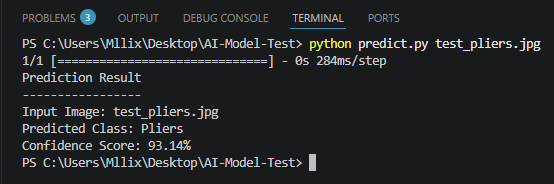

# AI Track

[Back to Main Page](../README.md)

## Overview

This page documents the tasks, progress, and learning outcomes related to the AI track of the robotics summer training program.

The AI track focuses on understanding artificial intelligence concepts, machine learning basics, computer vision, data processing, model training, and how AI can be used in robotics systems.

## Tasks

| Task No. | Task Name | Date | Status |
|---|---|---|---|
| 1 | Image Recognition Model Using Teachable Machine | 2026-07-11 | Completed |

## Completed Tasks

## Task 1: Image Recognition Model Using Teachable Machine

**Date:** 2026-07-11

**Track:** AI

**Status:** Completed

**Objective:**  
Train an image recognition model using Google Teachable Machine, export the trained model in TensorFlow/Keras format, and create a Python script that loads the model and predicts the class of an input image.

**Tools / Software Used:**  

- Google Teachable Machine
- Kaggle dataset
- Python 3.11.9
- Visual Studio Code
- TensorFlow / Keras
- NumPy
- Pillow
- GitHub

**Task Description:**  
This task focused on training a simple image classification model that can recognize three different hand tools. The model was trained using Google Teachable Machine with image datasets collected from Kaggle.

The model was trained using three classes:

- Screwdriver
- Wrench
- Pliers

Each class contained 200 images, giving a total of 600 training images.

After training and testing the model inside Teachable Machine, the model was exported in TensorFlow/Keras format. A Python script was then created to load the exported model, accept an input image, and predict the image class.

**Dataset Information:**  

The dataset images were collected from Kaggle and organized into three folders:

```text
AI-Image-Recognition-Dataset/
│
├── Screwdriver/
├── Wrench/
└── Pliers/
```

Each folder contained 200 images.

The full dataset was not uploaded to GitHub to avoid making the repository too large. Only the required model files, script, test image, and output screenshot were uploaded.

**Dataset Source:**  
[Diverse Tools Image Dataset for Machine Learning](https://www.kaggle.com/datasets/oortdatahub/diverse-tools-image-dataset-for-machine-learning)

**Steps:**  

1. Chose three image classes: Screwdriver, Wrench, and Pliers.
2. Downloaded and organized 200 images for each class.
3. Opened Google Teachable Machine.
4. Created a new image classification project.
5. Added the three classes to the project.
6. Uploaded the images for each class.
7. Trained the image recognition model.
8. Tested the model using sample images from each class.
9. Exported the trained model in TensorFlow/Keras format.
10. Downloaded the exported model files.
11. Created a Python script in Visual Studio Code.
12. Installed the required Python libraries.
13. Loaded the Keras model using the Python script.
14. Tested the script using an input image.
15. Saved a screenshot of the prediction output.
16. Uploaded the required files to GitHub.

**Model Evaluation:**  

The trained model was tested using sample images from each class. The model correctly predicted the tested screwdriver, wrench, and pliers images with high confidence.

Test results:

| Test Image | Predicted Class | Confidence |
|---|---|---|
| Screwdriver image | Screwdriver | 100% |
| Wrench image | Wrench | 100% |
| Pliers image | Pliers | 93.14% |

**Result / Output:**  

The Python script successfully loaded the trained Keras model and predicted the class of the input image.

For the test image `test_pliers.jpg`, the model predicted:

```text
Predicted Class: Pliers
Confidence Score: 93.14%
```

**Challenges:**  

- The first TensorFlow version installed was too new and caused a compatibility error when loading the Teachable Machine Keras model.
- The error was related to the `DepthwiseConv2D` layer inside the exported model.
- The issue was solved by installing a compatible TensorFlow version.
- Another challenge was making sure Python was installed correctly and added to PATH so it could run inside the VS Code terminal.

**What I Learned:**  

I learned how to train an image classification model using Google Teachable Machine and how to export it for use in Python. I also learned how to organize image datasets, test a trained model, use TensorFlow/Keras, and run a prediction script inside Visual Studio Code.

This task helped me understand the full basic workflow of an AI image recognition project:

```text
Dataset → Training → Evaluation → Export → Python Testing → GitHub Documentation
```

**Files / Links:**  

The required task files are stored in:

[Task 1 Image Recognition Folder](./Task-1-Image-Recognition)

Uploaded files:

- [Python Script](./Task-1-Image-Recognition/predict.py)
- [Trained Keras Model](./Task-1-Image-Recognition/keras_model.h5)
- [Labels File](./Task-1-Image-Recognition/labels.txt)
- [Test Image](./Task-1-Image-Recognition/test_pliers.jpg)
- [Prediction Output Screenshot](./Task-1-Image-Recognition/prediction-output-pliers.png)

**Output Screenshot:**  



## Tools and Topics

- Artificial intelligence basics
- Machine learning
- Image recognition
- Image classification
- Dataset preparation
- Model training
- Model evaluation
- TensorFlow / Keras
- Python scripting
- Visual Studio Code
- GitHub documentation
- Robotics perception

## Notes

- The model was trained using three classes: Screwdriver, Wrench, and Pliers.
- Each class contained 200 images.
- The full dataset was not uploaded to GitHub because it is large.
- TensorFlow 2.12.1 was used because it was compatible with the exported Teachable Machine Keras model.
- The output screenshot proves that the Python script successfully predicted the class of the test image.

## Reflection

This task helped me understand how image recognition models are trained and tested. I learned that AI projects are not only about training a model, but also about preparing the dataset, evaluating the results, exporting the model, writing a script to use it, and documenting the full process clearly on GitHub.
