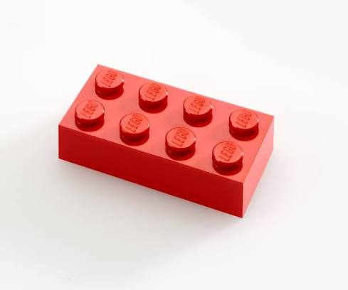
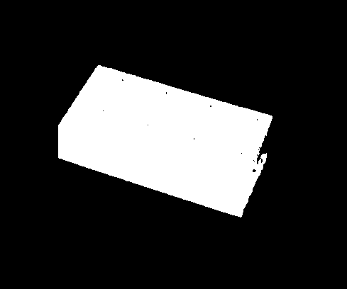
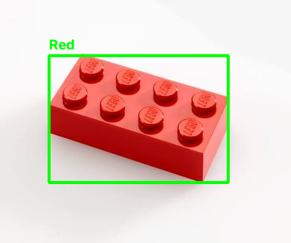
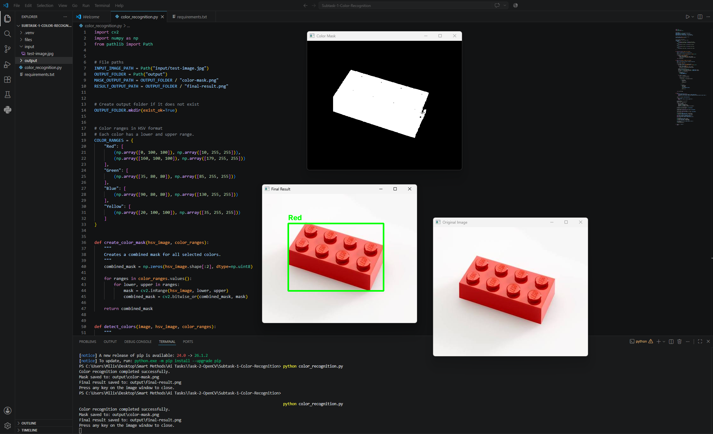

# Subtask 1 - Color Recognition Using OpenCV

[Back to Task 2 - OpenCV](../README.md)

## Overview

This subtask focused on using OpenCV to recognize colors in an image.

The program reads an input image, converts it to HSV color space, creates a color mask, detects colored areas, and draws a rectangle around the detected color.

This subtask was completed using an image file instead of a webcam because a webcam was not available at the time.

## Objective

The objective of this subtask was to practice basic computer vision using OpenCV by detecting colors from an image.

The program was designed to detect common colors such as:

- Red
- Green
- Blue
- Yellow

## Tools and Technologies Used

- Python
- OpenCV
- NumPy
- Visual Studio Code
- Image processing
- GitHub documentation

## Project Idea

The idea of this project is to recognize specific colors inside an image.

The program uses HSV color ranges to isolate selected colors from the original image. After detecting the color, it creates a mask and draws a bounding box around the detected area.

## How It Works

The program follows these steps:

1. Read the input image.
2. Resize the image if it is too large.
3. Convert the image from BGR to HSV color space.
4. Define HSV ranges for selected colors.
5. Create a color mask.
6. Remove small noise from the mask.
7. Find contours of the detected colored areas.
8. Draw a rectangle around the detected color.
9. Add the detected color name on the image.
10. Save the mask and final result images.

## Project Files

```text
Subtask-1-Color-Recognition/
├── README.md
├── files/
│   ├── color-mask.png
│   ├── final-result.png
│   ├── original-image.jpg
│   └── vscode-output.png
└── source-code/
    ├── color_recognition.py
    └── requirements.txt
```

## Source Code

The main source code file is:

```text
color_recognition.py
```

The required Python libraries are listed in:

```text
requirements.txt
```

The requirements file includes:

```text
opencv-python
numpy
```

## Input and Output

### Input

The input image was placed inside the local `input` folder and used as the test image for color recognition.

For GitHub documentation, the original image was uploaded to the `files` folder.

### Output

The program generated two main output files:

- `color-mask.png`
- `final-result.png`

The color mask shows the detected color area in white and the background in black.

The final result image shows the detected color with a rectangle and label.

## Screenshots

### Original Image



### Color Mask



### Final Result



### VS Code Output



## Result

The program successfully detected the red object in the image.

It created a color mask and drew a rectangle around the detected object with the label:

```text
Red
```

The final result confirmed that the OpenCV color recognition process worked correctly.

## Challenges

One challenge was choosing an image with clear lighting and a color that could be detected easily.

Another challenge was selecting suitable HSV color ranges so the program could detect the object correctly without detecting too much background noise.

## What I Learned

From this subtask, I learned:

- How to use OpenCV to read an image
- How to convert an image from BGR to HSV
- How HSV color detection works
- How to create a color mask
- How to detect contours
- How to draw rectangles around detected objects
- How to save output images using OpenCV
- How to document an OpenCV project on GitHub

## Reflection

This subtask helped me understand the basics of image processing and color recognition using OpenCV.

I learned that HSV color space is useful for detecting colors because it separates color information from brightness. This makes it easier to detect specific colors compared to using the normal BGR image format.

This was a good first OpenCV subtask because it did not require a webcam and could be completed using a normal image file.
