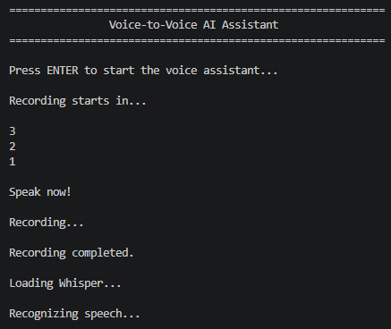
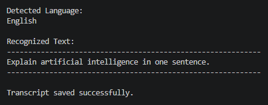
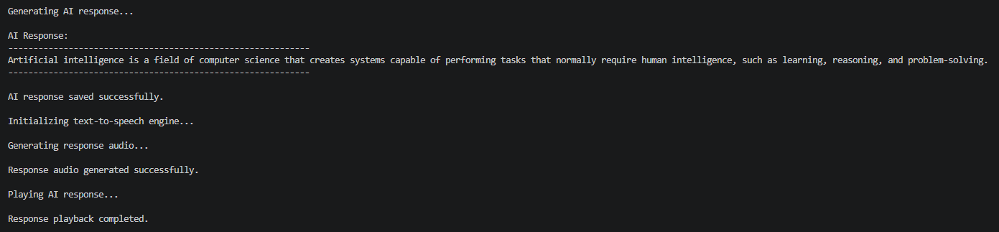
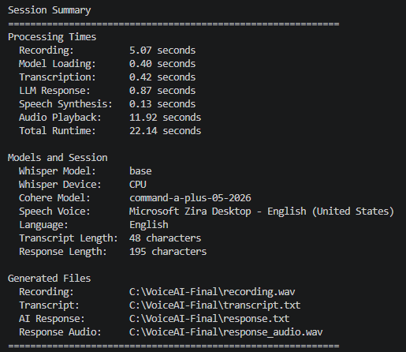
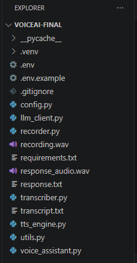

# Final Voice-to-Voice AI Assistant

This project integrates the three independent AI components developed in Task 3 into one complete **Voice-to-Voice AI Assistant**.

The application records a spoken question, converts the recording into text using OpenAI Whisper, sends the recognized text to Cohere, converts the generated AI response into speech, and plays the spoken response through the computer.

## Project Objective

The objective was to integrate the completed Speech-to-Text, LLM Processing, and Text-to-Speech subtasks into one modular application.

The final workflow is:

```text
User Voice
    ↓
Microphone Recording
    ↓
recording.wav
    ↓
OpenAI Whisper
    ↓
Recognized Transcript
    ↓
transcript.txt
    ↓
Cohere LLM
    ↓
Generated AI Response
    ↓
response.txt
    ↓
Text-to-Speech Engine
    ↓
response_audio.wav
    ↓
Spoken AI Response
```

## Completed Stages

The final assistant combines the following independently developed components:

1. **Speech-to-Text**
   - Records microphone audio
   - Uses Whisper to recognize speech
   - Detects the spoken language
   - Saves the transcript

2. **LLM Processing**
   - Sends the recognized transcript to Cohere
   - Generates an AI response
   - Displays and saves the response

3. **Text-to-Speech**
   - Converts the AI response into speech
   - Generates a WAV audio file
   - Plays the spoken response

## Features

- Records voice input directly from the microphone
- Displays a countdown before recording
- Saves the voice recording as `recording.wav`
- Uses OpenAI Whisper for speech recognition
- Automatically detects the spoken language
- Displays the recognized transcript
- Saves the transcript as `transcript.txt`
- Sends the transcript to Cohere
- Generates a relevant AI response
- Displays the generated response
- Saves the response as `response.txt`
- Converts the AI response into speech
- Saves the spoken response as `response_audio.wav`
- Automatically plays the generated response audio
- Measures the duration of every processing stage
- Displays model, language, voice, file, and timing information
- Protects the Cohere API key using environment variables
- Handles recording, transcription, API, file, and speech errors
- Uses a clean modular software architecture

## Technologies Used

- Python 3.11
- OpenAI Whisper
- Cohere Chat API
- Cohere Python SDK
- pyttsx3
- Windows SAPI5
- Windows `winsound`
- SoundDevice
- SciPy
- python-dotenv
- FFmpeg
- PyTorch
- Visual Studio Code
- GitHub

## Project Structure

```text
Final-Voice-Assistant
│
├── README.md
│
├── source-code
│   ├── .env.example
│   ├── .gitignore
│   ├── config.py
│   ├── llm_client.py
│   ├── recorder.py
│   ├── requirements.txt
│   ├── transcriber.py
│   ├── tts_engine.py
│   ├── utils.py
│   └── voice_assistant.py
│
├── files
│   ├── recording.wav
│   ├── transcript.txt
│   ├── response.txt
│   └── response_audio.wav
│
└── screenshots
    ├── ai-response-result.png
    ├── project-structure.png
    ├── session-summary.png
    ├── transcription-result.png
    └── voice-assistant-start.png
```

## System Architecture

The final project uses one controller and several independent service modules:

```text
                    ┌───────────────┐
                    │   config.py   │
                    └───────┬───────┘
                            │
                    ┌───────▼────────┐
                    │voice_assistant.py│
                    └───────┬────────┘
                            │
          ┌─────────────────┼─────────────────┐
          │                 │                 │
  ┌───────▼───────┐ ┌──────▼──────┐ ┌──────▼──────┐
  │  recorder.py  │ │transcriber.py│ │llm_client.py│
  └───────┬───────┘ └──────┬──────┘ └──────┬──────┘
          │                 │                 │
          └─────────────────┼─────────────────┘
                            │
                    ┌───────▼───────┐
                    │ tts_engine.py │
                    └───────┬───────┘
                            │
                    ┌───────▼───────┐
                    │   utils.py    │
                    └───────────────┘
```

Each module has one primary responsibility. The controller coordinates the modules without directly implementing their internal operations.

## Module Responsibilities

### `config.py`

Stores the shared settings used throughout the application.

Its responsibilities include:

- Loading environment variables
- Storing the Cohere API key
- Selecting the Cohere model
- Defining generated file paths
- Defining recording settings
- Selecting the Whisper model
- Defining LLM response settings
- Selecting the text-to-speech voice
- Defining speech rate and volume
- Defining terminal-interface settings

The generated-file paths include:

```python
RECORDING_FILE = BASE_DIR / "recording.wav"
TRANSCRIPT_FILE = BASE_DIR / "transcript.txt"
LLM_RESPONSE_FILE = BASE_DIR / "response.txt"
RESPONSE_AUDIO_FILE = BASE_DIR / "response_audio.wav"
```

### `recorder.py`

Handles microphone recording.

Its responsibilities include:

- Validating recording settings
- Capturing microphone audio
- Recording mono audio at 16 kHz
- Waiting for recording completion
- Removing the previous recording
- Saving the new recording as a WAV file
- Verifying that the generated recording exists
- Measuring recording time
- Returning structured recording information

### `transcriber.py`

Handles speech recognition using OpenAI Whisper.

Its responsibilities include:

- Selecting CPU or CUDA automatically
- Loading the configured Whisper model
- Measuring model-loading time
- Validating the recording file
- Transcribing recorded speech
- Detecting the spoken language
- Measuring transcription time
- Returning structured transcription information
- Handling missing, empty, or unrecognized audio

### `llm_client.py`

Handles communication with Cohere.

Its responsibilities include:

- Validating the Cohere API key
- Creating an authenticated Cohere client
- Sending the transcript to the Cohere Chat API
- Supplying system and user messages
- Extracting readable response text
- Measuring LLM response time
- Counting prompt and response characters
- Returning structured LLM information
- Handling authentication, API, and response errors

### `tts_engine.py`

Handles speech generation and playback.

Its responsibilities include:

- Initializing the Windows SAPI5 speech engine
- Selecting the preferred Windows voice
- Applying speech-rate and volume settings
- Falling back to another voice when necessary
- Removing the previous generated response audio
- Converting the AI response into a WAV file
- Validating the generated audio
- Playing the spoken response
- Measuring synthesis and playback times
- Returning structured speech information

### `utils.py`

Contains shared terminal and file utilities.

Its responsibilities include:

- Displaying the application banner
- Waiting for the user to begin
- Displaying the countdown
- Displaying status messages
- Converting language codes into readable names
- Displaying the recognized transcript
- Displaying the generated AI response
- Saving transcript and response text files
- Displaying the final session summary

### `voice_assistant.py`

Acts as the main application controller.

It coordinates the complete pipeline:

```text
Wait for User
      ↓
Record Voice
      ↓
Load Whisper
      ↓
Transcribe Recording
      ↓
Save Transcript
      ↓
Generate AI Response
      ↓
Save AI Response
      ↓
Generate Response Audio
      ↓
Play Spoken Response
      ↓
Display Session Summary
```

The controller does not directly implement recording, transcription, API communication, file handling, or speech synthesis.

## Configuration

### Audio Recording

```python
RECORDING_DURATION = 5
COUNTDOWN_SECONDS = 3
SAMPLE_RATE = 16_000
CHANNELS = 1
AUDIO_DTYPE = "int16"
```

The assistant records five seconds of mono microphone audio at a sample rate of 16 kHz.

### Whisper

```python
WHISPER_MODEL = "base"
```

The `base` Whisper model provides a practical balance between speed, resource usage, and recognition accuracy.

The application automatically selects:

```text
CUDA → when a supported GPU environment is available
CPU  → when CUDA is unavailable
```

### Cohere

```python
MAX_TOKENS = 500
TEMPERATURE = 0.3
```

The lower temperature helps produce focused and predictable responses.

The assistant uses a system message designed for spoken output:

```text
You are a helpful voice AI assistant.
Provide clear, accurate, and concise responses that sound natural
when spoken aloud.
```

### Text-to-Speech

```python
TTS_DRIVER = "sapi5"
PREFERRED_VOICE_INDEX = 1
SPEECH_RATE = 170
SPEECH_VOLUME = 1.0
```

The example session used:

```text
Microsoft Zira Desktop — English (United States)
```

If voice index `1` is unavailable on another computer, the application automatically falls back to the first installed voice.

## Environment Variable Security

The Cohere API key must never be written directly inside the Python files.

The real API key is stored locally in:

```text
.env
```

The `.env` file is excluded from GitHub by `.gitignore`.

The public repository includes:

```text
.env.example
```

Its safe contents are:

```env
COHERE_API_KEY=your_cohere_api_key_here
COHERE_MODEL=command-a-plus-05-2026
```

This template shows which environment variables are required without exposing private credentials.

## Installation

### 1. Clone or download the repository

Navigate to the final assistant source-code folder:

```powershell
cd AI\Task-3-Voice-to-Voice-AI-Assistant\Final-Voice-Assistant\source-code
```

### 2. Create a Python virtual environment

```powershell
py -3.11 -m venv .venv
```

### 3. Activate the environment

```powershell
.\.venv\Scripts\Activate.ps1
```

The terminal should begin with:

```text
(.venv)
```

If PowerShell blocks activation, run:

```powershell
Set-ExecutionPolicy -Scope Process -ExecutionPolicy Bypass
```

Then activate the environment again:

```powershell
.\.venv\Scripts\Activate.ps1
```

### 4. Install the Python dependencies

```powershell
python -m pip install --upgrade pip setuptools wheel
```

Then run:

```powershell
python -m pip install -r requirements.txt
```

The direct dependencies are:

```text
openai-whisper
sounddevice
scipy
cohere
python-dotenv
pyttsx3
```

### 5. Install FFmpeg

FFmpeg must be installed and available through the system PATH.

Verify the installation:

```powershell
ffmpeg -version
```

### 6. Configure the Cohere API key

Create a local file named:

```text
.env
```

Add:

```env
COHERE_API_KEY=your_actual_cohere_api_key
COHERE_MODEL=command-a-plus-05-2026
```

Replace the placeholder with a valid Cohere API key.

Never upload the real `.env` file.

## Running the Application

Run:

```powershell
python voice_assistant.py
```

The application will display:

```text
============================================================
                 Voice-to-Voice AI Assistant
============================================================

Press ENTER to start the voice assistant...
```

Press **Enter** to begin.

After the countdown, clearly ask a short question.

Example:

```text
Explain artificial intelligence in one sentence.
```

The application will then:

1. Record the spoken question
2. Save the recording
3. Load Whisper
4. Recognize the speech
5. Detect the spoken language
6. Display and save the transcript
7. Send the transcript to Cohere
8. Display and save the AI response
9. Generate the response audio
10. Play the spoken AI response
11. Display the session summary

## Example Session

### Spoken Question

```text
Explain artificial intelligence in one sentence.
```

### Recognized Transcript

```text
Explain artificial intelligence in one sentence.
```

### Generated AI Response

```text
Artificial intelligence is a field of computer science that creates
systems capable of performing tasks that normally require human
intelligence, such as learning, reasoning, and problem-solving.
```

The response is then converted into speech and played automatically.

## Generated Files

Each successful session creates four files.

### `recording.wav`

Contains the original microphone recording.

[Open the example voice recording](files/recording.wav)

### `transcript.txt`

Contains the text recognized by Whisper.

[Open the example transcript](files/transcript.txt)

### `response.txt`

Contains the response generated by Cohere.

[Open the example AI response](files/response.txt)

### `response_audio.wav`

Contains the spoken version of the Cohere response.

[Open the example spoken response](files/response_audio.wav)

Each new session replaces the previous generated files.

## Screenshots

### Application Startup and Recording

The application waits for the user, displays a countdown, records the microphone input, and begins loading Whisper.



### Speech Recognition

Whisper detects the spoken language, displays the recognized transcript, and saves it successfully.



### AI Response and Spoken Output

Cohere generates the response, the response is saved, and the Text-to-Speech module generates and plays the spoken answer.



### Session Summary

The final summary displays processing times, active models, detected language, selected voice, text lengths, and generated-file locations.



### Project Structure

The final application separates recording, transcription, LLM communication, speech generation, utilities, configuration, and application control.



## Example Performance

The documented example session produced the following processing results:

```text
Recording:          5.07 seconds
Model Loading:      0.40 seconds
Transcription:      0.42 seconds
LLM Response:       0.87 seconds
Speech Synthesis:   0.13 seconds
Audio Playback:    11.92 seconds
Total Runtime:     22.14 seconds
```

Session configuration:

```text
Whisper Model:      base
Whisper Device:     CPU
Cohere Model:       command-a-plus-05-2026
Speech Voice:       Microsoft Zira Desktop
Detected Language:  English
Transcript Length:  48 characters
Response Length:    195 characters
```

Processing time depends on the computer, Whisper model, recording length, internet connection, response length, and selected speech voice.

## Error Handling

The application includes controlled handling for:

- Invalid recording settings
- Microphone failures
- Missing or empty recording files
- Whisper model-loading failures
- Audio containing no recognizable speech
- Empty transcripts
- Missing Cohere API keys
- Invalid Cohere API keys
- Cohere request failures
- Unexpected API response formats
- Empty AI responses
- Transcript and response file-writing failures
- Missing Windows speech voices
- Text-to-Speech initialization failures
- Audio-generation failures
- Missing or empty generated response audio
- Audio-playback failures
- User cancellation with `Ctrl + C`

Expected errors are displayed as readable messages instead of causing uncontrolled application failures.

## Testing

The integrated application was tested through several scenarios.

### Complete Voice-to-Voice Session

The assistant successfully:

- Recorded a spoken question
- Recognized the speech
- Detected the language
- Generated an AI response
- Generated response audio
- Played the spoken answer
- Saved all four output files

### Silent Recording

The application displayed a controlled transcription error when no recognizable speech was detected.

### User Cancellation

Pressing `Ctrl + C` stopped the application without producing a long traceback.

### Repeated Sessions

New sessions correctly replaced:

```text
recording.wav
transcript.txt
response.txt
response_audio.wav
```

### Fresh Terminal

The application worked correctly after closing and reopening the VS Code terminal and reactivating the virtual environment.

### Credential Protection

The real `.env` file and API key were excluded from the GitHub repository.

## Design Approach

The project follows these principles:

### Single Responsibility

Each module has one main purpose.

### Separation of Concerns

Recording, transcription, LLM communication, speech generation, file handling, configuration, and application control are separated.

### Reusability

Each service can be reused independently.

For example:

```text
recorder.py
```

can record audio without knowing how Whisper works.

```text
transcriber.py
```

can transcribe any valid audio file without knowing where the audio came from.

```text
llm_client.py
```

can process any text input without knowing whether it came from speech recognition.

```text
tts_engine.py
```

can convert any text into speech without depending directly on Cohere.

### Maintainability

Settings are stored in one central configuration file.

### Security

Private API credentials are stored in environment variables and excluded from GitHub.

### Structured Results

Dataclasses are used to return named processing results rather than disconnected values.

## Development Process

The final assistant was developed using the following approach:

```text
Build Independently
        ↓
Test Independently
        ↓
Improve Each Module
        ↓
Integrate the Modules
        ↓
Test the Full Pipeline
        ↓
Prepare GitHub Documentation
```

The implementation stages were:

1. Complete Speech-to-Text independently
2. Complete LLM Processing independently
3. Complete Text-to-Speech independently
4. Create a clean final development folder
5. Install all integration dependencies
6. Create one shared configuration module
7. Integrate microphone recording
8. Integrate Whisper transcription
9. Integrate Cohere response generation
10. Integrate response-audio generation
11. Add text and audio file saving
12. Add terminal-interface utilities
13. Create the final controller
14. Add complete error handling
15. Add stage-by-stage performance measurements
16. Test silent input and cancellation
17. Test repeated sessions
18. Test from a fresh environment
19. Prepare safe example files
20. Document the complete project on GitHub

## Challenges and Solutions

### Integrating modules with duplicate filenames

The three independent subtasks each contained files such as `config.py` and `utils.py`.

Copying the files directly would have caused conflicts.

The final project solved this by creating a clean folder and carefully combining the required settings and utilities into shared final modules.

### Silent microphone recordings

Whisper initially returned no recognizable speech when the generated recording was silent or too quiet.

The solution included:

- Adding a countdown
- Clearly displaying `Speak now!`
- Testing the generated recording manually
- Speaking clearly during the configured recording period

### Protecting the API key

The Cohere API key could not be stored inside the source code.

The project uses:

```text
.env
.env.example
.gitignore
```

to separate private credentials from public configuration instructions.

### Supporting different computers

Installed Windows voices may differ between devices.

The application uses the preferred voice when available and falls back safely when it is not.

### Keeping the controller readable

The complete application performs many operations, but the controller remains understandable because each technical responsibility is delegated to a dedicated module.

## What I Learned

Through the final integration, I learned how to:

- Build a complete voice-processing pipeline
- Integrate independent Python modules
- Record and process microphone audio
- Use Whisper for speech recognition
- Detect spoken languages
- Connect a transcript to an LLM
- Use Cohere to generate AI responses
- Convert AI responses into speech
- Generate and play WAV files
- Manage shared application configuration
- Secure API credentials
- Measure individual processing stages
- Use dataclasses for structured results
- Handle errors across multiple services
- Design maintainable software architecture
- Test individual modules before integration
- Prepare a complete portfolio-quality GitHub project

## Result

The completed application successfully converts spoken input into a spoken AI response.

```text
Voice Question
      ↓
Speech-to-Text
      ↓
Recognized Transcript
      ↓
Cohere LLM
      ↓
Generated Response
      ↓
Text-to-Speech
      ↓
Spoken AI Answer
```

The final assistant works as one integrated application while preserving the modular design of the three original subtasks.

## Future Improvements

Possible future improvements include:

- Continuous multi-turn conversation mode
- Reusing the loaded Whisper model between sessions
- Conversation-history support
- Automatic microphone selection
- A graphical user interface
- Push-to-talk controls
- Streaming transcription
- Streaming LLM responses
- More natural cloud-based speech voices
- Arabic voice support
- Adjustable recording duration
- Automatic silence detection
- Voice activity detection
- Response interruption
- Faster GPU-based Whisper processing
- Packaging the application as a Windows executable

## Related Subtasks

- [Subtask 1 — Speech-to-Text](../Subtask-1-Speech-to-Text/README.md)
- [Subtask 2 — LLM Processing](../Subtask-2-LLM-Processing/README.md)
- [Subtask 3 — Text-to-Speech](../Subtask-3-Text-to-Speech/README.md)

## Navigation

- [Open the source code](source-code/)
- [Open the example files](files/)
- [Open the screenshots](screenshots/)
- [Back to Task 3](../README.md)
