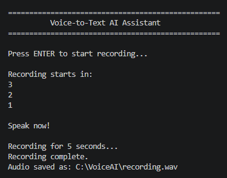
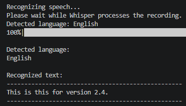
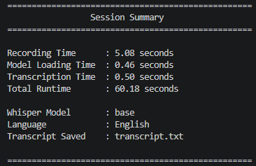
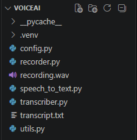

# Subtask 1 — Speech-to-Text

This subtask implements the first stage of the **Voice-to-Voice AI Assistant** by converting microphone audio into recognized text.

The application records the user's voice, saves the recording as a WAV file, processes it using OpenAI Whisper, detects the spoken language, displays the recognized text, and saves the final transcript to a text file.

## Project Objective

The objective of this subtask was to build an independent Speech-to-Text application that could later be integrated into the complete Voice-to-Voice AI Assistant.

The processing workflow is:

```text
Microphone Input
       ↓
Audio Recording
       ↓
recording.wav
       ↓
Whisper Speech Recognition
       ↓
Detected Language
       ↓
Recognized Text
       ↓
transcript.txt
```

## Features

- Records audio directly from the microphone
- Displays a countdown before recording
- Saves microphone input as `recording.wav`
- Uses OpenAI Whisper for speech recognition
- Automatically detects the spoken language
- Converts language codes into readable language names
- Displays the recognized text in the terminal
- Saves the recognized text to `transcript.txt`
- Measures recording, model-loading, and transcription times
- Displays a complete session summary
- Handles empty or unrecognized audio
- Handles user cancellation
- Uses a modular, single-responsibility architecture

## Technologies Used

- Python 3.11
- OpenAI Whisper
- SoundDevice
- SciPy
- FFmpeg
- Visual Studio Code
- GitHub

## Project Structure

```text
Subtask-1-Speech-to-Text
│
├── README.md
│
├── source-code
│   ├── config.py
│   ├── recorder.py
│   ├── requirements.txt
│   ├── speech_to_text.py
│   ├── transcriber.py
│   └── utils.py
│
├── files
│   ├── recording.wav
│   └── transcript.txt
│
└── screenshots
    ├── project-structure.png
    ├── session-summary.png
    ├── speech-to-text-start.png
    └── transcription-result.png
```

## Application Architecture

The project follows a modular structure in which every Python file has one main responsibility.

```text
speech_to_text.py
       │
       ├── config.py
       ├── recorder.py
       ├── transcriber.py
       └── utils.py
```

The main controller does not directly implement microphone recording, Whisper transcription, file saving, or terminal formatting. Instead, it calls the appropriate module for each operation.

## Module Responsibilities

### `config.py`

Stores the central application settings.

Its configuration includes:

- Recording duration
- Countdown duration
- Audio sample rate
- Number of audio channels
- Audio data type
- Whisper model name
- Recording file path
- Transcript file path
- Application title
- Terminal divider width

Keeping these settings in one file makes the application easier to update and maintain.

### `recorder.py`

Handles microphone recording and WAV-file creation.

Its responsibilities include:

- Capturing audio from the microphone
- Recording for the configured duration
- Waiting until audio capture is complete
- Saving the recording as `recording.wav`
- Measuring recording time
- Returning information about the completed recording
- Handling microphone and file-writing errors

### `transcriber.py`

Handles speech recognition using OpenAI Whisper.

Its responsibilities include:

- Loading the configured Whisper model
- Processing the recorded WAV file
- Recognizing spoken words
- Detecting the spoken language
- Returning the recognized text
- Measuring model-loading time
- Measuring transcription time
- Handling missing, empty, or unrecognized audio

### `utils.py`

Contains reusable terminal-interface and file-handling utilities.

Its responsibilities include:

- Displaying the application banner
- Waiting for the user to start
- Displaying the countdown
- Showing processing messages
- Converting language codes into readable names
- Displaying the detected language
- Displaying recognized text
- Saving the transcript
- Displaying the final session summary

### `speech_to_text.py`

Acts as the main application controller.

It coordinates the full process:

```text
Wait for User
      ↓
Countdown
      ↓
Record Audio
      ↓
Load Whisper
      ↓
Recognize Speech
      ↓
Display Result
      ↓
Save Transcript
      ↓
Display Summary
```

The controller remains readable because the technical responsibilities are separated into dedicated modules.

## Installation

### 1. Clone or download the repository

Navigate to the Speech-to-Text source-code folder:

```powershell
cd AI\Task-3-Voice-to-Voice-AI-Assistant\Subtask-1-Speech-to-Text\source-code
```

### 2. Create a virtual environment

```powershell
py -3.11 -m venv .venv
```

### 3. Activate the virtual environment

```powershell
.\.venv\Scripts\Activate.ps1
```

After activation, the terminal should begin with:

```text
(.venv)
```

If PowerShell blocks script execution, run:

```powershell
Set-ExecutionPolicy -Scope Process -ExecutionPolicy Bypass
```

Then activate the environment again:

```powershell
.\.venv\Scripts\Activate.ps1
```

### 4. Install the Python dependencies

```powershell
python -m pip install -r requirements.txt
```

The required packages are:

```text
openai-whisper
sounddevice
scipy
```

### 5. Install FFmpeg

FFmpeg must be installed and available through the system PATH because Whisper uses it to process audio files.

Verify the installation with:

```powershell
ffmpeg -version
```

If FFmpeg is installed correctly, version information will appear in the terminal.

## Running the Application

Run:

```powershell
python speech_to_text.py
```

The application will display:

```text
Voice-to-Text AI Assistant

Press ENTER to start recording...
```

Press **Enter** to begin.

The application will then:

1. Display a countdown
2. Record five seconds of microphone audio
3. Save the recording as `recording.wav`
4. Load the Whisper model
5. Process the recorded audio
6. Detect the spoken language
7. Display the recognized text
8. Save the transcript as `transcript.txt`
9. Display the session summary

## Example Workflow

```text
Press ENTER to start recording...

Recording starts in:
3
2
1

Speak now!

Recording for 5 seconds...
Recording complete.

Loading Whisper...

Recognizing speech...

Detected Language:
English

Recognized Text:
--------------------------------------------------
This is this for version 2.4.
--------------------------------------------------

Transcript saved successfully.
```

## Example Output Files

The application generates two main files.

### `recording.wav`

Contains the microphone audio recorded during the session.

[Open the example recording](files/recording.wav)

### `transcript.txt`

Contains the recognized text produced by Whisper.

[Open the example transcript](files/transcript.txt)

## Screenshots

### Application Startup and Countdown

The application waits for the user to press Enter, displays a countdown, and then records microphone audio.



### Transcription Result

Whisper processes the recording, detects the spoken language, and displays the recognized text.



### Session Summary

The final summary displays recording time, model-loading time, transcription time, total runtime, Whisper model, detected language, and transcript status.



### Project Structure

The source code is separated into configuration, recording, transcription, utilities, and controller modules.



## Session Information

The application reports useful information at the end of each successful session:

```text
Recording Time
Model Loading Time
Transcription Time
Total Runtime

Whisper Model
Detected Language
Transcript Saved
```

This information helps evaluate the performance of each processing stage.

## Error Handling

The application includes controlled handling for common problems, including:

- Microphone recording failures
- Invalid recording settings
- Missing recording files
- Empty recording files
- Whisper model-loading failures
- Speech transcription failures
- Audio containing no recognizable speech
- Transcript file-writing errors
- User cancellation using `Ctrl + C`

Expected problems are displayed as readable messages instead of producing uncontrolled application failures.

## Design Approach

The application follows the single-responsibility principle.

Instead of placing the entire program in one large Python file, the project separates:

- Configuration
- Microphone recording
- Speech recognition
- File handling
- Terminal interface
- Application control

This makes the project:

- Easier to understand
- Easier to test
- Easier to maintain
- Easier to improve
- Easier to reuse
- Easier to integrate into a larger system

## Development Process

The subtask was developed in stages:

1. Create the Python virtual environment
2. Install Whisper and audio dependencies
3. Verify FFmpeg
4. Test microphone recording
5. Save recorded audio as a WAV file
6. Load the Whisper model
7. Transcribe recorded speech
8. Detect the spoken language
9. Save the recognized transcript
10. Add countdown and user prompts
11. Add processing timers
12. Add a final session summary
13. Add error handling
14. Separate the application into reusable modules
15. Test the completed Speech-to-Text workflow

## Challenges and Solutions

### Silent or unclear recordings

Whisper initially returned no recognizable speech when the recording was silent or too quiet.

This was addressed by:

- Adding a countdown before recording
- Clearly displaying `Speak now!`
- Testing the generated WAV file manually
- Speaking clearly during the configured recording period

### Maintaining clean architecture

The application could have been written in one large file, but that would make future integration difficult.

The solution was to separate recording, transcription, utilities, configuration, and application control into independent modules.

### Language-code readability

Whisper returns short codes such as:

```text
en
ar
fr
```

The utility module converts these codes into readable names such as:

```text
English
Arabic
French
```

## What I Learned

Through this subtask, I learned how to:

- Record microphone audio using Python
- Work with audio sample rates and channels
- Save recorded data as a WAV file
- Use OpenAI Whisper for speech recognition
- Detect spoken languages automatically
- Work with FFmpeg
- Create and activate Python virtual environments
- Organize Python applications into reusable modules
- Use dataclasses to return structured results
- Measure processing times
- Validate generated files
- Handle microphone, transcription, and file errors
- Prepare an independent component for system integration
- Document a technical project on GitHub

## Result

The completed application successfully converts microphone input into recognized text.

```text
Voice Input
     ↓
recording.wav
     ↓
OpenAI Whisper
     ↓
Detected Language
     ↓
Recognized Text
     ↓
transcript.txt
```

This subtask works independently and is ready to be connected to the LLM Processing stage.

## Next Stage

The recognized transcript produced by this subtask will be passed into **Subtask 2 — LLM Processing**.

```text
Speech-to-Text
      ↓
Recognized Transcript
      ↓
LLM Processing
      ↓
Generated AI Response
```

[Back to Task 3](../README.md)
