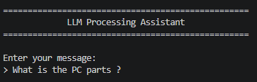
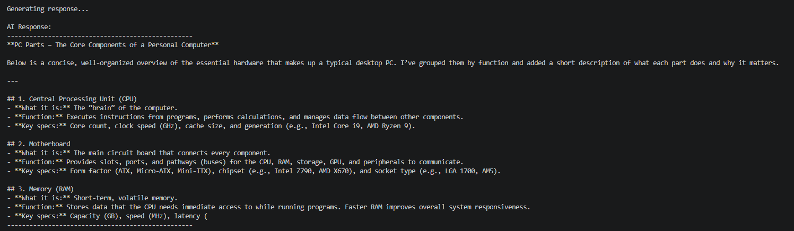
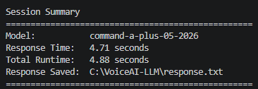
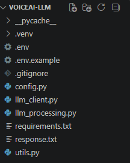

# Subtask 2 — LLM Processing

This subtask implements the second stage of the **Voice-to-Voice AI Assistant** by sending text input to a Large Language Model and receiving an AI-generated response.

The application accepts a user message, sends it to Cohere, displays the generated response, saves it to a text file, and reports processing information in a session summary.

## Project Objective

The objective of this subtask was to build an independent LLM Processing application that could later receive recognized speech from the Speech-to-Text stage.

The processing workflow is:

```text
Text Input
    ↓
Input Validation
    ↓
Cohere Chat API
    ↓
Generated AI Response
    ↓
Terminal Display
    ↓
response.txt
```

## Features

- Accepts text input from the user
- Validates and rejects empty input
- Connects to Cohere using the official Python SDK
- Uses the Cohere Chat API
- Sends system and user messages separately
- Displays the generated AI response
- Saves the latest response to `response.txt`
- Measures LLM response time
- Measures total application runtime
- Displays a complete session summary
- Protects the Cohere API key using environment variables
- Includes a safe `.env.example` configuration template
- Handles API, input, file, and user-cancellation errors
- Uses a modular, single-responsibility architecture

## Technologies Used

- Python 3.11
- Cohere
- Cohere Chat API
- python-dotenv
- Visual Studio Code
- GitHub

## Project Structure

```text
Subtask-2-LLM-Processing
│
├── README.md
│
├── source-code
│   ├── .env.example
│   ├── .gitignore
│   ├── config.py
│   ├── llm_client.py
│   ├── llm_processing.py
│   ├── requirements.txt
│   └── utils.py
│
├── files
│   └── example-response.txt
│
└── screenshots
    ├── ai-response-result.png
    ├── llm-processing-start.png
    ├── project-structure.png
    └── session-summary.png
```

## Application Architecture

The project follows a modular architecture in which every Python file has one main responsibility.

```text
llm_processing.py
       │
       ├── config.py
       ├── llm_client.py
       └── utils.py
```

The main controller does not directly implement API authentication, Cohere request handling, response extraction, terminal formatting, or file writing.

Instead, it calls the appropriate module for each operation.

## Module Responsibilities

### `config.py`

Stores the central application configuration.

Its responsibilities include:

- Loading environment variables from `.env`
- Reading the Cohere API key
- Storing the selected Cohere model
- Defining the response-file path
- Defining maximum response tokens
- Defining the generation temperature
- Defining the assistant system message
- Storing terminal-interface settings

Keeping these values in one file makes the project easier to update and maintain.

### `llm_client.py`

Handles communication with Cohere.

Its responsibilities include:

- Verifying that the Cohere API key exists
- Creating an authenticated Cohere client
- Sending messages to the Cohere Chat API
- Passing the system and user messages to the model
- Extracting readable text from the API response
- Measuring the response time
- Returning structured response information
- Converting Cohere errors into readable application errors

### `utils.py`

Contains reusable terminal-interface and file-handling utilities.

Its responsibilities include:

- Displaying the application banner
- Reading and validating user input
- Displaying processing messages
- Displaying the AI response
- Saving the generated response
- Displaying the final session summary

### `llm_processing.py`

Acts as the main application controller.

It coordinates the full process:

```text
Display Banner
      ↓
Read User Message
      ↓
Create Cohere Client
      ↓
Generate AI Response
      ↓
Display Response
      ↓
Save Response
      ↓
Display Session Summary
```

The controller remains readable because all technical responsibilities are separated into dedicated modules.

## Environment Variable Security

The Cohere API key is private and must never be written directly inside the Python source code.

The real key is stored locally in:

```text
.env
```

This file is excluded from GitHub through `.gitignore`.

The repository contains a safe template named:

```text
.env.example
```

Its contents are:

```env
COHERE_API_KEY=your_cohere_api_key_here
COHERE_MODEL=command-a-plus-05-2026
```

The `.env.example` file explains which environment variables are required without exposing private credentials.

## Installation

### 1. Clone or download the repository

Navigate to the LLM Processing source-code folder:

```powershell
cd AI\Task-3-Voice-to-Voice-AI-Assistant\Subtask-2-LLM-Processing\source-code
```

### 2. Create a virtual environment

```powershell
py -3.11 -m venv .venv
```

### 3. Activate the virtual environment

```powershell
.\.venv\Scripts\Activate.ps1
```

After activation, the terminal should begin with:

```text
(.venv)
```

If PowerShell blocks script execution, run:

```powershell
Set-ExecutionPolicy -Scope Process -ExecutionPolicy Bypass
```

Then activate the environment again:

```powershell
.\.venv\Scripts\Activate.ps1
```

### 4. Install the dependencies

```powershell
python -m pip install -r requirements.txt
```

The direct dependencies are:

```text
cohere
python-dotenv
```

## Cohere API Configuration

### 1. Create the local `.env` file

Inside the `source-code` folder, create:

```text
.env
```

### 2. Add the required environment variables

```env
COHERE_API_KEY=your_actual_cohere_api_key
COHERE_MODEL=command-a-plus-05-2026
```

Replace the placeholder API key with a valid Cohere key.

Do not add quotation marks, spaces around `=`, or the word `Bearer`.

### 3. Protect the API key

The included `.gitignore` prevents `.env` from being uploaded:

```gitignore
.env
```

Never publish the real API key in GitHub, screenshots, documentation, or source-code files.

## Running the Application

Run:

```powershell
python llm_processing.py
```

The application will display:

```text
==================================================
             LLM Processing Assistant
==================================================

Enter your message:
>
```

Enter a question or instruction, then press Enter.

The application will:

1. Validate the message
2. Connect to Cohere
3. Send the message to the selected model
4. Wait for the generated response
5. Display the AI response
6. Save the response as `response.txt`
7. Display the session summary

## Example Prompt

```text
What are the main PC parts?
```

## Example Workflow

```text
Enter your message:
> What are the main PC parts?

Generating response...

AI Response:
--------------------------------------------------
The main parts of a personal computer include the
processor, motherboard, memory, storage, graphics
card, power supply, cooling system, and case.
--------------------------------------------------

Response saved successfully.
```

## Example Output File

### `example-response.txt`

Contains a safe example response generated by the application.

[Open the example AI response](files/example-response.txt)

During normal use, the application generates:

```text
response.txt
```

The generated `response.txt` file is ignored by Git because it changes after every successful session.

## Screenshots

### Application Startup

The application displays its title and waits for the user to enter a message.



### Generated AI Response

Cohere processes the user message and returns a generated response.



### Session Summary

The application displays the selected model, response time, total runtime, and saved-file location.



### Project Structure

The source code is separated into configuration, API communication, utilities, and application-controller modules.



## Session Information

The application reports useful information at the end of every successful session:

```text
Model
Response Time
Total Runtime
Response Saved
```

This information helps verify which model was used and how long the generation process required.

## Response Configuration

The application uses centralized response settings inside `config.py`.

### Model

```python
COHERE_MODEL = "command-a-plus-05-2026"
```

### Maximum Tokens

```python
MAX_TOKENS = 500
```

This limits the maximum length of the generated response.

### Temperature

```python
TEMPERATURE = 0.3
```

A lower temperature helps produce more focused and predictable responses.

### System Message

```text
You are a helpful AI assistant.
Provide clear, accurate, and well-structured responses.
```

The system message defines the assistant's general behavior.

## Error Handling

The application includes controlled handling for common problems, including:

- Missing Cohere API key
- Invalid Cohere API key
- Network or API request failures
- Empty user input
- Empty or unexpected Cohere responses
- Response file-writing failures
- User cancellation using `Ctrl + C`

Expected errors are displayed as readable messages instead of causing uncontrolled application failures.

## Design Approach

The application follows the single-responsibility principle.

Instead of placing the entire program in one large Python file, the project separates:

- Configuration
- Environment variables
- Cohere authentication
- LLM communication
- Response extraction
- Terminal input and output
- File handling
- Application control

This makes the project:

- Easier to understand
- Easier to test
- Easier to maintain
- Easier to secure
- Easier to improve
- Easier to reuse
- Easier to integrate into the final voice assistant

## Development Process

The subtask was developed in stages:

1. Create a separate development folder
2. Create a Python virtual environment
3. Install Cohere and python-dotenv
4. Create and protect the `.env` file
5. Create the shared configuration module
6. Build the Cohere client module
7. Test API authentication
8. Send the first live LLM request
9. Build terminal-interface utilities
10. Add response-file saving
11. Create the main application controller
12. Add response and runtime measurements
13. Add controlled error handling
14. Test empty input and user cancellation
15. Test the application from a fresh terminal
16. Prepare safe files for GitHub

## Challenges and Solutions

### Protecting the API key

Placing the API key directly in Python would create a security risk.

The solution was to:

- Store the real key in `.env`
- Load it using `python-dotenv`
- Exclude `.env` using `.gitignore`
- Provide a safe `.env.example` template

### Handling Cohere authentication errors

The first live API request failed because the placeholder key was still being used.

The problem was identified through the `401 Unauthorized` response and fixed by adding the valid Cohere API key to `.env`.

### Maintaining clean architecture

The application could have placed input, API requests, file saving, and error handling inside one file.

Instead, the project separates those responsibilities into independent modules, making the application easier to integrate later.

### Processing structured API responses

Cohere returns generated text inside response content blocks.

The application extracts all readable blocks rather than assuming the entire answer will always exist in only one position.

## What I Learned

Through this subtask, I learned how to:

- Connect a Python application to an LLM API
- Use Cohere's Python SDK
- Send system and user messages to a chat model
- Extract generated text from an API response
- Secure API keys using environment variables
- Use `.env`, `.env.example`, and `.gitignore`
- Measure API response time
- Save generated text to a file
- Validate user input
- Handle authentication and API failures
- Organize an LLM application into reusable modules
- Use dataclasses for structured results
- Prepare an independent LLM component for system integration
- Document an API-based project on GitHub

## Result

The completed application successfully accepts text input and produces an AI-generated response.

```text
Text Input
    ↓
Cohere Chat API
    ↓
AI Response
    ↓
Terminal Display
    ↓
response.txt
```

This subtask works independently and is ready to receive the transcript produced by the Speech-to-Text stage.

## Integration Role

In the completed Voice-to-Voice AI Assistant, this module will receive the recognized transcript from Whisper:

```text
Speech-to-Text
      ↓
Recognized Transcript
      ↓
LLM Processing
      ↓
Generated AI Response
```

The generated response will then be sent to the Text-to-Speech stage.

## Next Stage

The AI response produced by this subtask will be passed into **Subtask 3 — Text-to-Speech**.

```text
LLM Processing
      ↓
Generated AI Response
      ↓
Text-to-Speech
      ↓
Spoken Audio Response
```

[Back to Task 3](../README.md)
