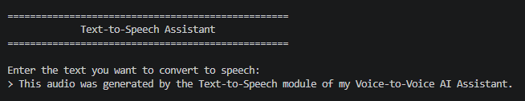
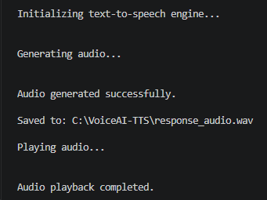
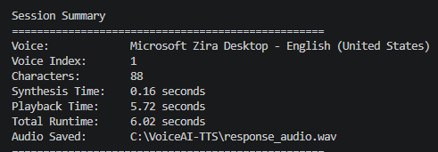
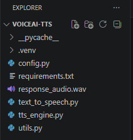

# Subtask 3 — Text-to-Speech

This subtask implements the third stage of the **Voice-to-Voice AI Assistant** by converting text into spoken audio.

The application accepts text from the user, generates a WAV audio file using the Windows text-to-speech system, plays the generated speech, and displays detailed session information.

## Project Objective

The objective of this subtask was to build an independent Text-to-Speech application that could later receive the response generated by the LLM Processing stage.

The processing workflow is:

```text
Text Input
    ↓
Input Validation
    ↓
Text-to-Speech Engine
    ↓
response_audio.wav
    ↓
Audio Playback
```

## Features

- Accepts text input from the user
- Validates and rejects empty input
- Uses the Windows SAPI5 speech engine
- Uses an installed Windows voice
- Supports configurable voice selection
- Supports configurable speech rate
- Supports configurable speech volume
- Generates speech as `response_audio.wav`
- Replaces the previous audio file during each session
- Automatically plays the generated audio
- Measures speech-synthesis time
- Measures audio-playback time
- Measures total application runtime
- Displays selected voice information
- Displays the number of converted characters
- Handles speech-generation and playback errors
- Handles user cancellation
- Uses a modular, single-responsibility architecture

## Technologies Used

- Python 3.11
- pyttsx3
- Windows SAPI5
- Windows `winsound`
- Visual Studio Code
- GitHub

## Project Structure

```text
Subtask-3-Text-to-Speech
│
├── README.md
│
├── source-code
│   ├── config.py
│   ├── requirements.txt
│   ├── text_to_speech.py
│   ├── tts_engine.py
│   └── utils.py
│
├── files
│   └── response_audio.wav
│
└── screenshots
    ├── audio-generation-result.png
    ├── project-structure.png
    ├── session-summary.png
    └── text-to-speech-start.png
```

## Application Architecture

The project follows a modular architecture in which every Python file has one main responsibility.

```text
text_to_speech.py
        │
        ├── config.py
        ├── tts_engine.py
        └── utils.py
```

The main controller does not directly implement speech-engine initialization, voice selection, WAV-file generation, playback, terminal formatting, or input validation.

Instead, it calls the appropriate module for each operation.

## Module Responsibilities

### `config.py`

Stores the central application configuration.

Its responsibilities include:

- Defining the generated audio-file path
- Selecting the Windows text-to-speech driver
- Selecting the preferred voice index
- Defining the speech rate
- Defining the speech volume
- Storing the application title
- Defining terminal-interface formatting

The current settings include:

```python
TTS_DRIVER = "sapi5"
PREFERRED_VOICE_INDEX = 1
SPEECH_RATE = 170
SPEECH_VOLUME = 1.0
```

Keeping these settings in one file makes the application easier to update and maintain.

### `tts_engine.py`

Handles speech generation and playback.

Its responsibilities include:

- Initializing the pyttsx3 engine
- Configuring the speech rate
- Configuring the speech volume
- Reading available Windows voices
- Selecting the preferred voice
- Falling back to the first voice when necessary
- Removing the previous generated audio file
- Converting text into a WAV file
- Verifying that the WAV file exists
- Verifying that the WAV file is not empty
- Playing the generated audio
- Measuring synthesis and playback times
- Returning structured speech-generation information

### `utils.py`

Contains reusable terminal-interface utilities.

Its responsibilities include:

- Displaying the application banner
- Reading user text input
- Rejecting empty input
- Displaying processing messages
- Displaying the final session summary

### `text_to_speech.py`

Acts as the main application controller.

It coordinates the complete process:

```text
Display Banner
      ↓
Read Text Input
      ↓
Initialize TTS Engine
      ↓
Generate Audio
      ↓
Save WAV File
      ↓
Play Audio
      ↓
Display Session Summary
```

The controller remains readable because the technical responsibilities are separated into dedicated modules.

## Voice Configuration

The application uses the Windows speech voices installed on the computer.

During development, the available voices were tested individually. Voice index `1` was selected because it provided the clearest result.

The selected voice in the example session was:

```text
Microsoft Zira Desktop — English (United States)
```

The preferred voice is configured in `config.py`:

```python
PREFERRED_VOICE_INDEX = 1
```

Another computer may have a different number or order of installed voices.

To prevent the application from crashing, `tts_engine.py` checks whether the preferred index exists. If it does not exist, the application safely selects voice index `0`.

## Speech Rate

The configured speech rate is:

```python
SPEECH_RATE = 170
```

A lower value produces slower speech, while a higher value produces faster speech.

The selected value provides a clear and natural starting speed for the assistant.

## Speech Volume

The configured volume is:

```python
SPEECH_VOLUME = 1.0
```

The pyttsx3 volume range is:

```text
0.0 → Silent
1.0 → Maximum
```

The final speaker volume is also affected by the Windows system volume.

## Installation

### 1. Clone or download the repository

Navigate to the Text-to-Speech source-code folder:

```powershell
cd AI\Task-3-Voice-to-Voice-AI-Assistant\Subtask-3-Text-to-Speech\source-code
```

### 2. Create a virtual environment

```powershell
py -3.11 -m venv .venv
```

### 3. Activate the virtual environment

```powershell
.\.venv\Scripts\Activate.ps1
```

After activation, the terminal should begin with:

```text
(.venv)
```

If PowerShell blocks script execution, run:

```powershell
Set-ExecutionPolicy -Scope Process -ExecutionPolicy Bypass
```

Then activate the environment again:

```powershell
.\.venv\Scripts\Activate.ps1
```

### 4. Install the dependency

```powershell
python -m pip install -r requirements.txt
```

The required package is:

```text
pyttsx3
```

## Running the Application

Run:

```powershell
python text_to_speech.py
```

The application will display:

```text
==================================================
             Text-to-Speech Assistant
==================================================

Enter the text you want to convert to speech:
>
```

Enter a sentence and press Enter.

The application will then:

1. Validate the entered text
2. Initialize the Windows text-to-speech engine
3. Select the configured voice
4. Generate `response_audio.wav`
5. Verify that the audio file was created
6. Display the saved-file location
7. Play the generated speech
8. Display the session summary

## Example Input

```text
This audio was generated by the Text-to-Speech module of my Voice-to-Voice AI Assistant.
```

## Example Workflow

```text
Enter the text you want to convert to speech:
> This audio was generated by the Text-to-Speech module of my Voice-to-Voice AI Assistant.

Initializing text-to-speech engine...

Generating audio...

Audio generated successfully.

Saved to:
C:\VoiceAI-TTS\response_audio.wav

Playing audio...

Audio playback completed.
```

## Example Output File

### `response_audio.wav`

Contains the spoken version of the entered text.

[Open the example generated audio](files/response_audio.wav)

Each successful session replaces the previous `response_audio.wav` file with the newest generated audio.

## Screenshots

### Application Startup

The application displays its title and asks the user to enter text for speech generation.



### Audio Generation Result

The application initializes the text-to-speech engine, generates the WAV file, saves it, and plays the result.



### Session Summary

The final summary displays the selected voice, voice index, character count, synthesis time, playback time, total runtime, and generated file location.



### Project Structure

The source code is separated into configuration, speech-engine, utility, and controller modules.



## Session Information

The application reports useful information at the end of each successful session:

```text
Voice
Voice Index
Characters
Synthesis Time
Playback Time
Total Runtime
Audio Saved
```

This information helps verify the selected voice and evaluate the performance of the speech-generation stage.

## Generated Audio Validation

Before playback, the application verifies that:

- The generated WAV file exists
- The output path points to a file
- The generated file contains data
- The previous audio file was removed
- The new audio file was successfully created

These checks prevent the application from playing an old, missing, or empty audio file.

## Error Handling

The application includes controlled handling for common problems, including:

- Empty text input
- Missing Windows speech voices
- Invalid preferred voice index
- Text-to-speech engine initialization failures
- Voice-configuration failures
- Previous audio-file removal failures
- Speech-synthesis failures
- Missing or empty generated audio
- Audio-playback failures
- File-system errors
- User cancellation using `Ctrl + C`

Expected problems are displayed as readable messages instead of producing uncontrolled application failures.

## Design Approach

The application follows the single-responsibility principle.

Instead of placing the entire program in one large Python file, the project separates:

- Configuration
- Voice selection
- Speech-engine initialization
- Audio generation
- File validation
- Audio playback
- Terminal input and output
- Application control

This makes the project:

- Easier to understand
- Easier to test
- Easier to maintain
- Easier to configure
- Easier to improve
- Easier to reuse
- Easier to integrate into the final voice assistant

## Development Process

The subtask was developed in stages:

1. Create a separate development folder
2. Create a Python virtual environment
3. Install pyttsx3
4. Test the Windows SAPI5 speech engine
5. List the installed Windows voices
6. Test each available voice
7. Select the clearest voice
8. Create the central configuration module
9. Build the speech-engine module
10. Generate the first WAV audio file
11. Add WAV-file playback
12. Add terminal-interface utilities
13. Build the main application controller
14. Add voice fallback handling
15. Add output-file validation
16. Add synthesis and playback timing
17. Add a final session summary
18. Test empty input and cancellation
19. Test replacement of previous audio
20. Test the application from a fresh terminal
21. Prepare the example audio and screenshots for GitHub

## Challenges and Solutions

### Selecting the best installed voice

The available Windows voices were listed and tested individually.

Voice index `1` produced the preferred result, so it was selected in the configuration.

A fallback system was added to select voice `0` if the preferred index is unavailable on another computer.

### Generating and replacing WAV files

The application needs every successful session to produce the newest response audio.

The solution was to remove the previous WAV file before generating a new one, then verify that the replacement file exists and contains data.

### Separating speech generation from the interface

Speech generation, terminal input, playback, configuration, and session reporting could have been placed in one file.

Instead, these responsibilities were separated into dedicated modules to make future integration easier.

### Supporting independent use

The Text-to-Speech module accepts ordinary text and does not depend directly on Cohere.

This allows it to work with different text sources:

```text
Typed Text ──────────┐
LLM Response ────────┼──→ Text-to-Speech
Saved Text File ─────┘
```

## What I Learned

Through this subtask, I learned how to:

- Convert text into speech using Python
- Use the Windows SAPI5 speech engine
- Work with installed Windows voices
- Configure speech rate and volume
- Select and validate a preferred voice
- Generate WAV audio files
- Play WAV files using Python
- Validate generated files
- Measure synthesis and playback times
- Handle text-to-speech and playback failures
- Organize a speech application into reusable modules
- Use dataclasses for structured results
- Prepare an independent Text-to-Speech component for system integration
- Document an audio-based project on GitHub

## Result

The completed application successfully converts text into a spoken audio response.

```text
Text Input
    ↓
Text-to-Speech Engine
    ↓
response_audio.wav
    ↓
Audio Playback
```

This subtask works independently and is ready to receive the generated response from the LLM Processing stage.

## Integration Role

In the completed Voice-to-Voice AI Assistant, this module will receive the response generated by Cohere:

```text
LLM Processing
      ↓
Generated AI Response
      ↓
Text-to-Speech
      ↓
response_audio.wav
      ↓
Spoken AI Response
```

## Next Stage

The three independent components are now ready to be integrated:

```text
Speech-to-Text
      ↓
LLM Processing
      ↓
Text-to-Speech
```

The next stage is the **Final Voice-to-Voice AI Assistant**, which connects microphone input directly to a spoken AI response.

[Back to Task 3](../README.md)
