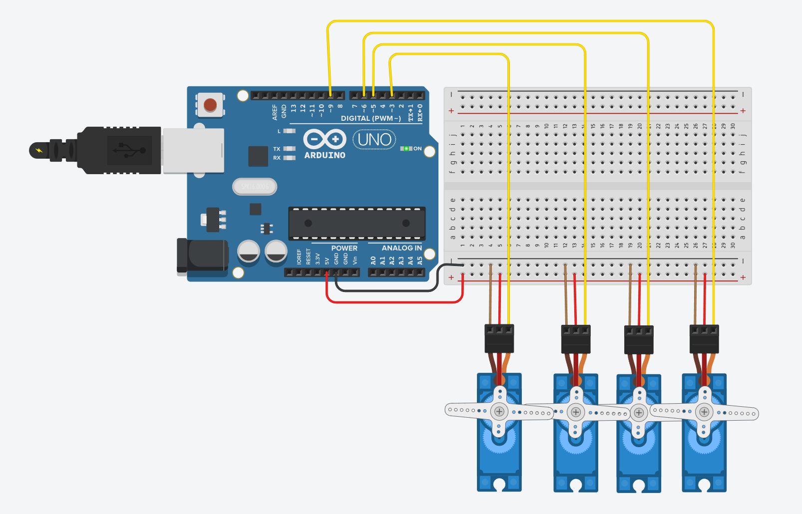

# Task 1: Four Servo Motors Control Using Tinkercad

[Back to Electrical Track](../README.md)

## Task Information

**Date:** 2026-07-14  
**Track:** Electrical  
**Status:** Completed  

## Objective

Program four servo motors in Tinkercad using Arduino so that all motors run using a sweep motion for 2 seconds, then stop and hold at 90 degrees.

## Tools / Software Used

- Tinkercad Circuits
- Arduino Uno
- 4 Micro Servo Motors
- Breadboard
- Arduino C/C++
- GitHub

## Task Description

This task focused on controlling multiple servo motors using an Arduino Uno in Tinkercad. The requirement was to program four servo motors to run using a sweep motion for 2 seconds, then make all motors hold their position at 90 degrees.

The circuit was built in Tinkercad using an Arduino Uno, a breadboard, and four servo motors. Each servo motor was connected to a digital PWM pin on the Arduino, while all motors shared the same 5V and GND connections through the breadboard power rails.

## Circuit Connections

| Servo Motor | Signal Pin | Power | Ground |
|---|---|---|---|
| Servo 1 | D3 | 5V rail | GND rail |
| Servo 2 | D5 | 5V rail | GND rail |
| Servo 3 | D6 | 5V rail | GND rail |
| Servo 4 | D9 | 5V rail | GND rail |

The Arduino 5V pin was connected to the breadboard positive rail, and the Arduino GND pin was connected to the breadboard negative rail.

## Steps

1. Opened Tinkercad Circuits.
2. Added an Arduino Uno to the workspace.
3. Added a breadboard to organize the power and ground connections.
4. Added four micro servo motors.
5. Connected the Arduino 5V pin to the breadboard positive rail.
6. Connected the Arduino GND pin to the breadboard negative rail.
7. Connected each servo power wire to the positive rail.
8. Connected each servo ground wire to the negative rail.
9. Connected the servo signal wires to Arduino pins D3, D5, D6, and D9.
10. Wrote the Arduino code using the Servo library.
11. Programmed the servos to sweep for 2 seconds.
12. Programmed all servos to hold at 90 degrees after the sweep.
13. Ran the simulation in Tinkercad.
14. Saved the circuit screenshot and Arduino code file.
15. Uploaded the files to GitHub.

## Arduino Code

The Arduino code is stored in the files folder:

[servo-code.ino](./files/servo-code.ino)

## Circuit Screenshot

## Result / Output

The four servo motors successfully ran the sweep motion for 2 seconds. After the sweep motion ended, all four servo motors moved to and held at 90 degrees.

A simulation GIF will be added later to show the servo motors moving in Tinkercad.

## Challenges

- Wiring four servo motors required organizing the power and ground connections clearly.
- All servos needed to share the same 5V and GND rails.
- The code needed to stop the sweep after exactly 2 seconds.
- The motors had to hold at 90 degrees after the sweep instead of continuing to move.

## What I Learned

I learned how to control multiple servo motors using an Arduino Uno and the Servo library. I also learned how to organize shared power and ground connections using a breadboard, assign different signal pins to each servo, and use timing logic with `millis()` to run a motion for a specific duration.

This task helped me understand how servo motors can be controlled together in a robotic system.

## Files / Links

All task files are stored inside the `files` folder.

- [Arduino Code](./files/servo-code.ino)
- [Tinkercad Circuit Screenshot](./files/tinkercad-circuit.png)

## Notes

- This task was completed using Tinkercad simulation.
- In real hardware, using four servo motors directly from the Arduino 5V pin may not be recommended because servos can draw high current.
- For a real circuit, an external 5V power supply would usually be used for the servo motors, with the external power supply ground connected to the Arduino ground.
- A simulation GIF will be added later.

## Reflection

This task helped me understand the basics of controlling multiple servo motors with Arduino. I learned that the signal wire controls the servo angle, while the power and ground wires must be connected correctly for all motors to work. I also learned how timing can be used in code to control how long a motion runs before changing to a fixed position.
