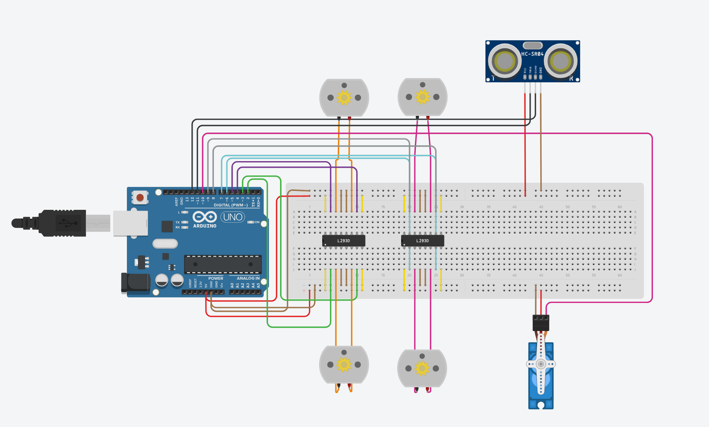
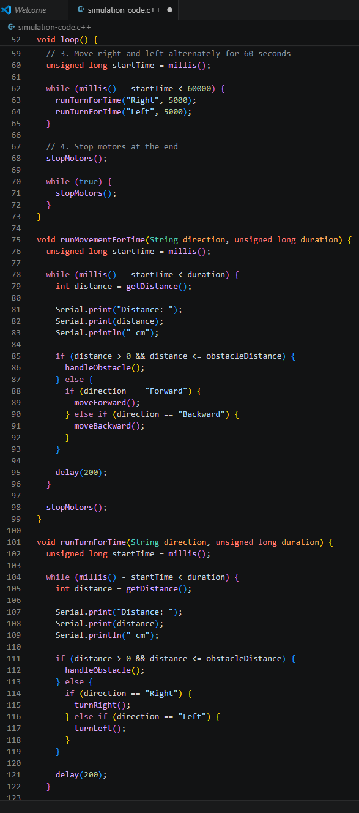
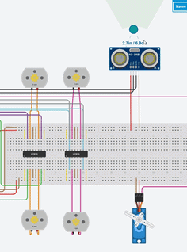

# Subtask 1 - Tinkercad Simulation

[Back to Task 2](../README.md)

## Overview

This subtask focused on simulating a DC motor control and obstacle avoidance system using Tinkercad.

The simulation uses an Arduino Uno, two L293D motor drivers, four DC motors, an ultrasonic sensor, and a servo motor. The DC motors are controlled through the L293D motor drivers, while the ultrasonic sensor detects obstacles. When an obstacle is detected at a distance of 10 cm or less, the motors stop and the servo motor scans left and right.

This subtask represents the simulation part of Electrical Task 2. The hands-on hardware implementation will be completed later when the physical components arrive.

## Objective

The objective of this subtask was to build and simulate a motor control system that can:

- Control four DC motors using L293D motor drivers
- Move the motors forward
- Move the motors backward
- Turn right and left alternately
- Detect obstacles using an ultrasonic sensor
- Stop the motors when an obstacle is detected
- Move a servo motor to simulate scanning after obstacle detection

## Task Requirements

The simulation was based on the following requirements:

1. Control four DC motors using an L293D motor driver.
2. Move the motors forward for 30 seconds.
3. Move the motors backward for 60 seconds.
4. Move right and left alternately for 60 seconds.
5. Add an ultrasonic sensor to detect obstacles.
6. Add a servo motor.
7. If the ultrasonic sensor detects an obstacle at 10 cm or less, the motors should stop.
8. The servo motor should move to simulate scanning after obstacle detection.

## Tools and Components Used

### Software

- Tinkercad Circuits
- Arduino IDE inside Tinkercad
- GitHub

### Components

- Arduino Uno R3
- 2 × L293D motor driver ICs
- 4 × DC motors
- Ultrasonic sensor HC-SR04
- Micro servo motor
- Breadboard
- Jumper wires

## Circuit Explanation

The circuit uses two L293D motor drivers because one L293D can control two DC motors. Since the task requires four DC motors, two motor drivers were used.

The first L293D controls Motor 1 and Motor 2.  
The second L293D controls Motor 3 and Motor 4.

The ultrasonic sensor is used to measure the distance in front of the system. If the measured distance is 10 cm or less, the motors stop and the servo motor moves left and right to simulate scanning.

## Pin Connections

| Arduino Pin | Connected Component | Purpose |
|---|---|---|
| D2 | L293D 1 Input 1 | Motor 1 control |
| D3 | L293D 1 Input 2 | Motor 1 control |
| D4 | L293D 1 Input 3 | Motor 2 control |
| D5 | L293D 1 Input 4 | Motor 2 control |
| D6 | L293D 2 Input 1 | Motor 3 control |
| D7 | L293D 2 Input 2 | Motor 3 control |
| D8 | L293D 2 Input 3 | Motor 4 control |
| D9 | L293D 2 Input 4 | Motor 4 control |
| D10 | Servo signal | Servo motor control |
| D11 | Ultrasonic TRIG | Sends ultrasonic pulse |
| D12 | Ultrasonic ECHO | Receives reflected pulse |
| 5V | Breadboard power rail | Component power |
| GND | Breadboard ground rail | Common ground |

## How the Simulation Works

The Arduino program follows this sequence:

1. The four DC motors move forward for 30 seconds.
2. The four DC motors move backward for 60 seconds.
3. The motors turn right and left alternately for 60 seconds.
4. The ultrasonic sensor continuously checks the distance.
5. If the distance is greater than 10 cm, the motors continue moving.
6. If the distance is 10 cm or less, the motors stop.
7. The servo motor scans left and right.
8. After the movement sequence is complete, the motors stop.

## Source Code

The Arduino code used in the simulation is saved here:

[simulation-code.ino](./files/simulation-code.ino)

## Files

```text
Subtask-1-Tinkercad-Simulation/
├── README.md
└── files/
    ├── simulation-circuit.png
    ├── simulation-code.png
    ├── simulation-demo.gif
    └── simulation-code.ino
```

## Screenshots and Simulation Demo

### Full Circuit



### Arduino Code



### Simulation Demo



## Result

The simulation worked successfully.

The four DC motors moved according to the required sequence. The ultrasonic sensor detected obstacles, and when the distance reached 10 cm or less, the motors stopped. The servo motor then moved left and right to simulate scanning for another direction.

## Challenges

One challenge was wiring the L293D motor drivers correctly because each motor requires two control inputs and two output connections.

Another challenge was making sure the motor directions matched. Some motors needed reversed logic in the code so that all motors moved in the correct direction during forward and backward movement.

Combining the motor sequence with the ultrasonic sensor and servo motor also required organizing the code into clear functions.

## What I Learned

From this subtask, I learned:

- How to control DC motors using an L293D motor driver
- How one L293D can control two DC motors
- Why two L293D motor drivers are needed for four DC motors
- How to control motor direction using Arduino digital pins
- How to use an ultrasonic sensor to measure distance
- How to stop motors when an obstacle is detected
- How to control a servo motor using Arduino
- How to combine motor control and sensor input in one simulation
- How to document a Tinkercad simulation on GitHub

## Hands-On Implementation Note

This subtask only covers the Tinkercad simulation.

The hands-on hardware implementation will be completed later when the required physical components arrive.
