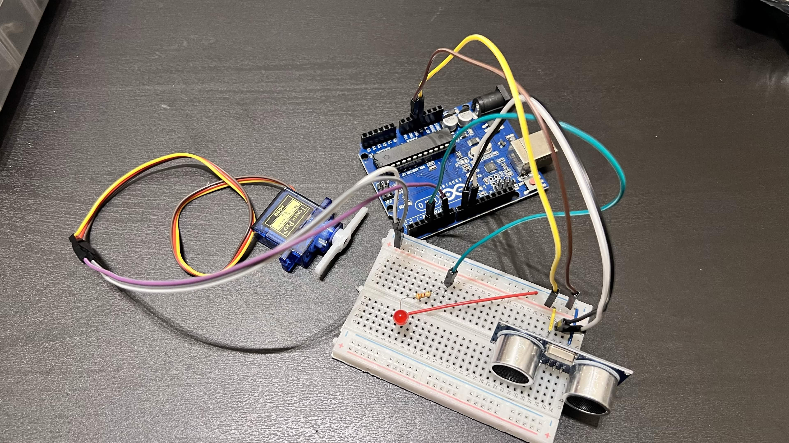
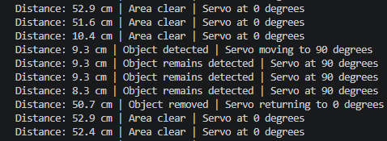

# Subtask 2 – Hands-On Ultrasonic Servo Control

## Overview

This subtask implements a physical Arduino system that controls an SG90 servo motor using distance measurements from an HC-SR04 ultrasonic sensor.

When an object is detected within the activation distance, the servo moves from its original position to the activated angle. When the object moves away, the servo automatically returns to its original position.

An LED is also included as a movement indicator. It turns on while the servo is moving and turns off after the movement is complete.

---

## Objectives

- Connect an HC-SR04 ultrasonic sensor to an Arduino Uno.
- Measure the distance between the sensor and nearby objects.
- Control an SG90 servo motor based on the measured distance.
- Return the servo automatically when the object moves away.
- Use an LED to indicate servo movement.
- Experiment with different servo angles.
- Experiment with different detection distances.
- Keep the system configurable using one clean program.

---

## Components

- Arduino Uno
- HC-SR04 ultrasonic sensor
- SG90 servo motor
- LED
- 330 Ω resistor
- Breadboard
- Jumper wires
- USB data cable

---

## Circuit Connections

### HC-SR04 Ultrasonic Sensor

| HC-SR04 Pin | Arduino Uno |
|---|---|
| VCC | 5V |
| TRIG | Digital pin 9 |
| ECHO | Digital pin 10 |
| GND | GND |

### SG90 Servo Motor

| Servo Wire | Function | Arduino Uno |
|---|---|---|
| Brown | Ground | GND |
| Red | Power | 5V |
| Orange/Yellow | Signal | Digital pin 6 |

### LED

| LED Connection | Arduino Uno |
|---|---|
| Long leg, anode (+) | Digital pin 3 through a 330 Ω resistor |
| Short leg, cathode (−) | GND |

All components share a common ground.

---

## Circuit Overview



---

## System Logic

The final system uses the following settings:

| Setting | Value |
|---|---:|
| Original servo angle | 0° |
| Activated servo angle | 90° |
| Activation distance | 10 cm |
| Return distance | 12 cm |
| Serial Monitor speed | 9600 baud |

The system operates as follows:

1. The HC-SR04 continuously measures the distance to the nearest object.
2. When an object reaches `10 cm` or closer, the LED turns on.
3. The servo moves from `0°` to `90°`.
4. The LED turns off after the servo finishes moving.
5. The servo remains at `90°` while the object is nearby.
6. When the object moves beyond `12 cm`, the LED turns on again.
7. The servo returns from `90°` to `0°`.
8. The LED turns off after the return movement is complete.

---

## Stability Range

The activation and return distances are intentionally different:

```text
Activation distance: 10 cm
Return distance: 12 cm
```

This creates a small stability range that prevents the servo from repeatedly switching positions when the ultrasonic reading fluctuates near `10 cm`.

For example:

```text
9.8 cm  → Servo activates
10.3 cm → Servo remains activated
11.5 cm → Servo remains activated
12.1 cm → Servo returns
```

---

## Adjustable Parameters

The system behavior can be changed using the constants near the beginning of [`files/src/main.cpp`](files/src/main.cpp).

### Servo Angles

```cpp
const int ORIGINAL_ANGLE = 0;
const int ACTIVATED_ANGLE = 90;
```

- `ORIGINAL_ANGLE` controls the servo position when the area is clear.
- `ACTIVATED_ANGLE` controls the servo position when an object is detected.

For example, the activated angle can be changed to:

```cpp
const int ACTIVATED_ANGLE = 45;
```

or:

```cpp
const int ACTIVATED_ANGLE = 135;
```

### Detection Distances

```cpp
const float ACTIVATION_DISTANCE_CM = 10.0;
const float RETURN_DISTANCE_CM = 12.0;
```

- `ACTIVATION_DISTANCE_CM` determines when the servo activates.
- `RETURN_DISTANCE_CM` determines when the servo returns.

The return distance should normally be slightly larger than the activation distance to prevent unstable switching.

---

## Experiments

### Servo Angle Experiment

The servo was tested using different activated angles while keeping the activation distance at `10 cm`.

| Test | Activated Angle | Observation |
|---|---:|---|
| 1 | 45° | Small and smooth movement |
| 2 | 90° | Clear and practical movement |
| 3 | 135° | Larger movement |
| 4 | 160° | Worked but was close to the servo limit |

The final activated angle was set to `90°` because it provided clear movement without approaching the mechanical limit of the SG90 servo.

### Detection Distance Experiment

The ultrasonic sensor was tested using different activation distances while keeping the activated servo angle at `90°`.

| Test | Activation Distance |
|---|---:|
| 1 | 5 cm |
| 2 | 10 cm |
| 3 | 15 cm |
| 4 | 20 cm |

The final activation distance was set to `10 cm` to match the task requirements.

Only one configurable program was kept instead of creating separate code files for every experiment.

---

## Serial Monitor

The Serial Monitor displays:

- The current measured distance
- Whether the area is clear
- Whether an object has been detected
- The current servo position
- Servo activation and return events
- Missing ultrasonic echo warnings



Example output:

```text
Distance: 16.4 cm | Area clear | Servo at 0 degrees
Distance: 8.7 cm | Object detected | Servo moving to 90 degrees
Distance: 11.0 cm | Object remains detected | Servo at 90 degrees
Distance: 14.2 cm | Object removed | Servo returning to 0 degrees
```

---

## Demonstration

https://github.com/user-attachments/assets/d4135d56-9bde-4af8-a45c-80e0698b2b74

The demonstration shows:

- The complete physical circuit
- Distance measurement using the HC-SR04 sensor
- Servo movement when an object enters the detection range
- LED operation while the servo is moving
- The servo remaining activated while the object is nearby
- Automatic servo return when the object moves away

---

## Project Structure

```text
Subtask-2-Hands-On-Servo-Control/
├── files/
│   ├── media/
│   │   ├── circuit-overview.jpg
│   │   ├── hands-on-demo.mov
│   │   └── serial-monitor.png
│   ├── src/
│   │   └── main.cpp
│   ├── .gitignore
│   └── platformio.ini
└── README.md
```

The `files` folder contains the PlatformIO project files and the media used in this documentation.

PlatformIO may automatically generate additional local development folders after the project is opened:

```text
.pio/
.vscode/
include/
lib/
test/
```

These generated folders are not required in the GitHub repository.

---

## Software and Tools

- Visual Studio Code
- PlatformIO IDE
- Arduino framework
- Arduino Servo library
- PlatformIO Serial Monitor

---

## PlatformIO Configuration

The project uses an Arduino Uno environment and the Arduino Servo library.

The [`files/platformio.ini`](files/platformio.ini) file contains:

```ini
[env:uno]
platform = atmelavr
board = uno
framework = arduino
monitor_speed = 9600

lib_deps =
    arduino-libraries/Servo
```

PlatformIO normally detects the Arduino upload port automatically.

If automatic detection fails, the upload port can temporarily be added:

```ini
upload_port = COM3
```

The COM port may be different on another computer.

---

## Running the Project

1. Download or clone the repository.
2. Open the `files` folder in Visual Studio Code.
3. Install the PlatformIO IDE extension.
4. Connect the Arduino Uno using a USB data cable.
5. Confirm that Windows detects the Arduino.
6. Build the project using PlatformIO.
7. Upload the program to the Arduino.
8. Open the PlatformIO Serial Monitor at `9600` baud.
9. Place an object farther than `12 cm` from the sensor.
10. Move the object to `10 cm` or closer.
11. Observe the LED and servo movement.
12. Move the object beyond `12 cm`.
13. Confirm that the servo returns automatically.

---

## Troubleshooting

### Servo Does Not Move

- Check that the servo signal wire is connected to digital pin 6.
- Check that the red wire is connected to 5V.
- Check that the brown wire is connected to GND.
- Confirm that the Servo library is installed through PlatformIO.
- Check that the servo connector is facing the correct direction.

### Incorrect Distance Readings

- Check the TRIG and ECHO connections.
- Make sure the object is facing the ultrasonic sensor.
- Avoid placing the object extremely close to the sensor.
- Confirm that all components share a common ground.
- Check for loose jumper-wire connections.

### Arduino Restarts or Disconnects

The SG90 servo can briefly draw a relatively high current while moving.

If the Arduino restarts or the sensor readings become unstable:

- Check for loose connections.
- Disconnect the circuit immediately if any component becomes hot.
- Consider powering the servo using a separate regulated 5V supply.
- Connect the external power-supply ground to the Arduino ground.

### Upload Fails

- Confirm that the Arduino is detected by Windows.
- Check the COM port in Device Manager.
- Use a USB cable that supports data transfer.
- Try a different USB port.
- Add the correct `upload_port` to `platformio.ini` if automatic detection fails.

---

## Results

The completed system successfully:

- Measured object distance using the HC-SR04 sensor.
- Activated the SG90 servo when an object reached the selected distance.
- Returned the servo automatically when the object moved away.
- Used an LED to indicate servo movement.
- Displayed distance and system status through the Serial Monitor.
- Prevented unstable switching near the detection threshold.
- Allowed the servo angles and detection distances to be changed easily.
- Used one configurable program for all experiments.

---

## Learning Outcomes

Through this subtask, I learned how to:

- Connect and use an HC-SR04 ultrasonic sensor.
- Convert ultrasonic echo duration into distance measurements.
- Control an SG90 servo motor using the Arduino Servo library.
- Combine sensor input with actuator output.
- Use an LED as a system status indicator.
- Use state-based logic to avoid repeated servo commands.
- Improve system stability using separate activation and return thresholds.
- Test different servo angles and detection distances.
- Develop Arduino projects using PlatformIO and Visual Studio Code.
- Use the PlatformIO Serial Monitor for testing and debugging.
- Organize and document a physical electronics project for GitHub.
