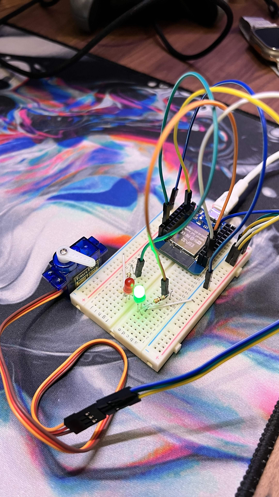
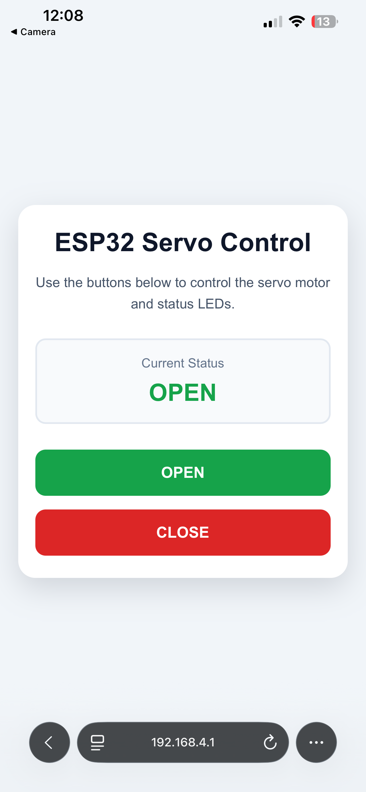
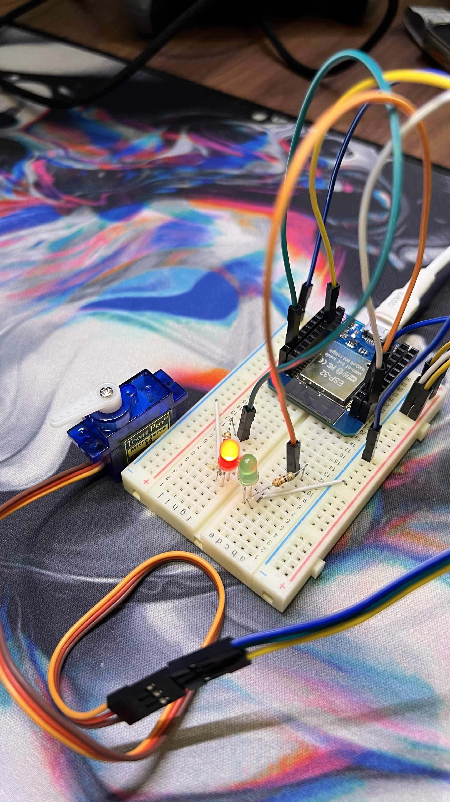
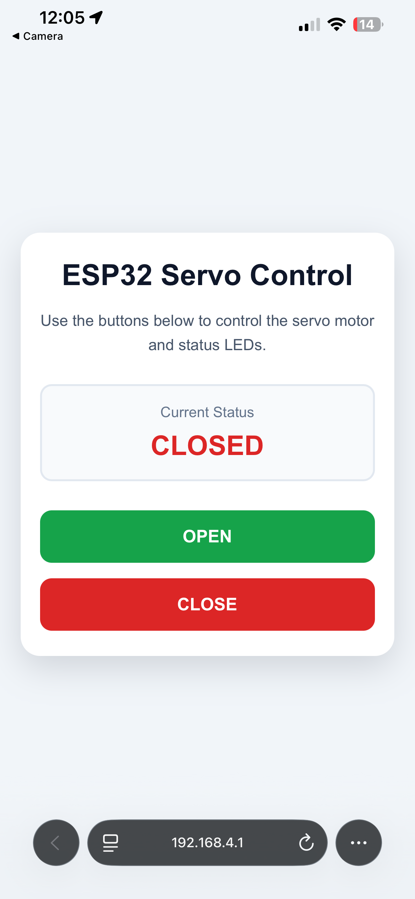
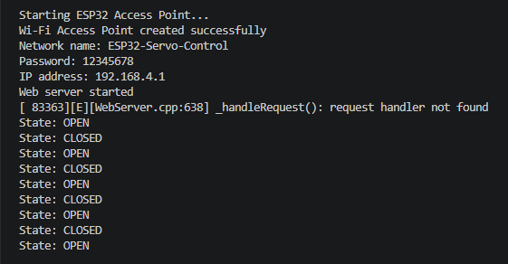

# Task 3: ESP32 Web-Controlled Servo Motor

[Back to Electrical Track](../README.md)

## Overview

This project uses an ESP32 to create its own Wi-Fi network and host a local webpage for controlling a servo motor.

The webpage contains two buttons:

- **OPEN**
- **CLOSE**

Two LEDs show the current state:

- Green LED: Open
- Red LED: Closed

The circuit was first tested in Wokwi and then implemented using a physical ESP32.

---

## Components Used

| Component | Quantity |
|---|---:|
| ESP32 38-pin development board | 1 |
| Servo motor | 1 |
| Green LED | 1 |
| Red LED | 1 |
| 220 Ω resistor | 2 |
| Breadboard | 1 |
| Jumper wires | Several |
| Micro-USB cable | 1 |

---

## Pin Connections

| Component | ESP32 Pin |
|---|---|
| Servo signal | GPIO 18 |
| Green LED | GPIO 26 |
| Red LED | GPIO 27 |
| Servo power | 5V / VCC |
| Ground | GND |

### Green LED

```text
GPIO 26 → 220 Ω resistor → Green LED anode
Green LED cathode → GND
```

### Red LED

```text
GPIO 27 → 220 Ω resistor → Red LED anode
Red LED cathode → GND
```

---

## System Operation

### Open State

When the **OPEN** button is pressed:

- Servo moves to `90°`
- Green LED turns on
- Red LED turns off
- Webpage displays `OPEN`

<p align="center">
  
  
</p>

### Closed State

When the **CLOSE** button is pressed:

- Servo moves to `0°`
- Red LED turns on
- Green LED turns off
- Webpage displays `CLOSED`

<p align="center">
  
  
</p>

---

## Wi-Fi Access Point

The ESP32 creates its own Wi-Fi network:

```text
Network name: ESP32-Servo-Control
Password: 12345678
IP address: 192.168.4.1
```

After connecting to the ESP32 network, the control page is opened using:

```text
http://192.168.4.1
```

No internet connection is required.

---

## Serial Monitor Output

The Serial Monitor shows the Wi-Fi Access Point information, IP address, web server status, and Open or Close commands.

<p align="center">
  
</p>

---

## Software and Tools

- Visual Studio Code
- PlatformIO
- Arduino framework
- ESP32Servo library
- Wokwi
- GitHub

---

## Project Files

```text
Task-3-ESP32-Web-Controlled-Servo/
├── README.md
├── platformio.ini
├── src/
│   └── main.cpp
├── media/
│   ├── serial-monitor-output.png
│   ├── servo-close-state.png
│   ├── servo-open-state.png
│   ├── web-control-close-page.png
│   └── web-control-open-page.png
└── wokwi/
    ├── diagram.json
    ├── sketch.ino
    └── libraries.txt
```

---

## Result

The project worked successfully.

The ESP32 created a local Wi-Fi network and hosted a webpage that controlled the servo motor. The LEDs and webpage status updated correctly for both the Open and Closed states.

---

## What I Learned

- Configuring the ESP32 as a Wi-Fi Access Point
- Hosting a webpage on an ESP32
- Controlling a servo motor through a browser
- Using LEDs to show system status
- Uploading and monitoring ESP32 code using PlatformIO
- Testing a project in Wokwi before building the physical circuit
