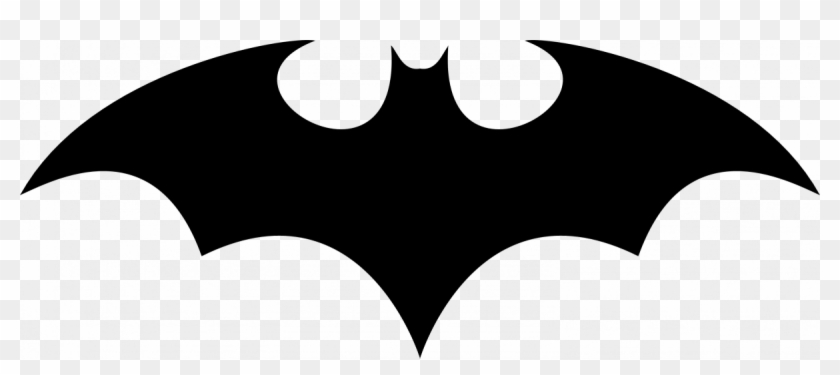
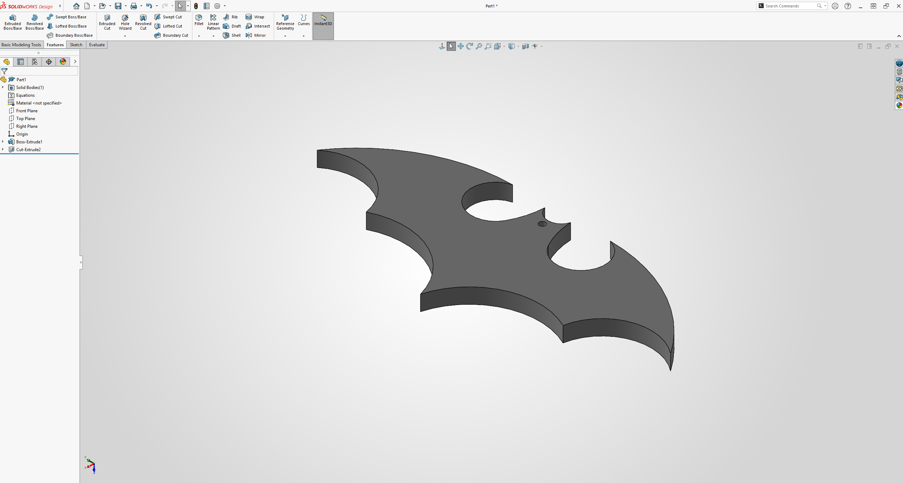

# Task 2: Batman Logo Keychain Design Using SolidWorks

[Back to Mechanical Track](../README.md)

## Task Information

**Date:** 2026-07-14  
**Track:** Mechanical  
**Status:** Completed  

## Objective

Create a 3D keychain design based on a Batman logo reference image using SolidWorks, estimate the design dimensions, add a circular keychain hole, extrude the sketch, export the model as an STL file, and upload the final files to GitHub.

## Tools / Software Used

- SolidWorks
- Online reference image
- STL export
- GitHub

## Task Description

This task focused on practicing basic mechanical design using SolidWorks. The goal was to choose a simple logo image, estimate its dimensions, redraw the shape in SolidWorks, add a functional keychain hole, extrude the sketch into a 3D part, and export the final model as an STL file.

For this task, I used a Batman logo as a reference image. The image was used only as a visual reference to estimate the shape and measurements. The model was recreated in SolidWorks by sketching the logo outline, adding a circular hole for the keychain ring, and extruding the design.

## Design Requirements

- Choose a reference image from the internet.
- Estimate the design measurements based on the reference image.
- Redraw the logo shape manually in SolidWorks.
- Add a circular hole with a diameter of 3 mm for the keychain ring.
- Extrude the design by 2 mm.
- Export the final model as an STL file.
- Upload the STL file and design files to GitHub.

## Steps

1. Chose a Batman logo image as the reference design.
2. Estimated the main dimensions of the logo based on the reference image.
3. Opened SolidWorks and created a new part file.
4. Started a new sketch on the selected plane.
5. Redrew the Batman logo outline using SolidWorks sketch tools.
6. Adjusted the sketch dimensions to make the design suitable for a keychain.
7. Added a circular hole with a diameter of 3 mm for the keychain ring.
8. Extruded the sketch by 2 mm to create the 3D model.
9. Checked the final model shape, thickness, and hole position.
10. Saved the SolidWorks part file.
11. Exported the final design as an STL file.
12. Uploaded the final files to GitHub.

## Result / Output

A 3D Batman logo keychain model was successfully created using SolidWorks. The design includes a circular keychain hole and a 2 mm extrusion thickness. The final model was exported as an STL file and uploaded to GitHub with the related design files.

## Challenges

- Estimating the dimensions from the reference image required careful visual judgment.
- Recreating the curved logo shape in SolidWorks required accurate sketching.
- The keychain hole needed to be placed in a suitable location without weakening the design.
- The model had to be thick enough to be printable while keeping the logo shape clear.

## What I Learned

I learned how to use a 2D reference image to create a 3D model in SolidWorks. I practiced estimating dimensions, sketching curved shapes, adding a circular keychain hole, extruding a sketch, saving the SolidWorks part file, and exporting the final model as an STL file.

This task helped me understand how simple reference images can be converted into 3D printable parts.

## Files / Links

- [STL File](./files/BatMan-Logo-Task-2.STL)
- [SolidWorks Part File](./files/Batman-Logo-Task-2.SLDPRT)
- [Reference Image](./files/Reference-Batman-Logo.png)
- [SolidWorks Design Screenshot](./files/image-Batman-Logo-SolidWorks.png)

## Design Screenshots

**Reference Image:**

**SolidWorks Design Screenshot:**

## Reference Note

The Batman logo was used as a visual reference to practice converting a 2D shape into a 3D printable model. The focus of this task was on sketching, dimension estimation, extrusion, and STL export using SolidWorks.
