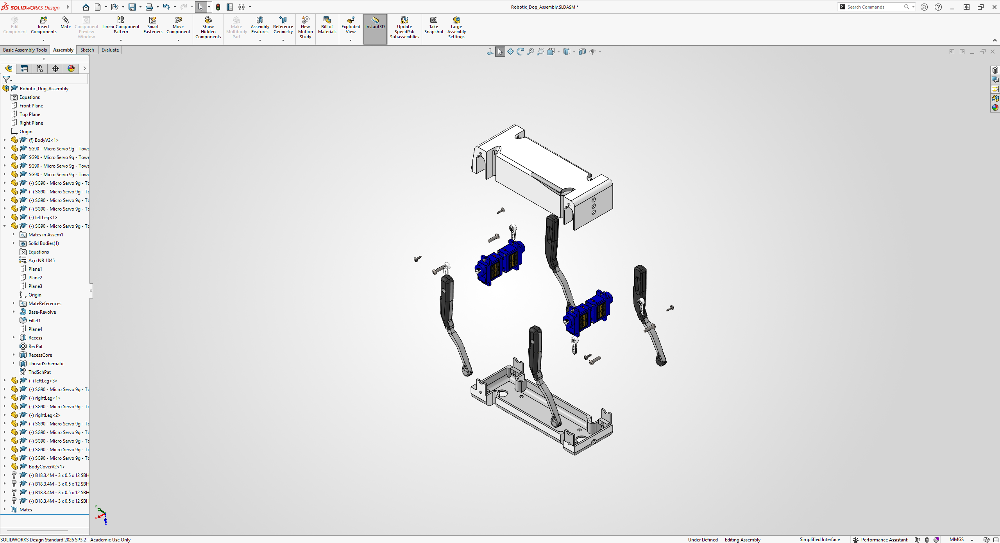

# Mechanical Task 4 – Exploded View of the Robot

[Back to Mechanical Track](../README.md)

## Overview

This task focused on creating a complete robot assembly and producing an exploded view animation using SOLIDWORKS.

The robot was first assembled by positioning its body, legs, servo motors, screws, and other components using assembly mates. After completing the assembly, an exploded view was created to clearly demonstrate the position, arrangement, and assembly sequence of the robot components.

## Objective

The objectives of this task were to:

- Create a complete robot assembly in SOLIDWORKS.
- Position the robot components using assembly mates.
- Create an organized exploded view of the robot.
- Separate the components in clear and logical directions.
- Add explode lines to show where the components connect.
- Generate an animation of the exploded view.
- Export and document the final result.

## Software Used

- SOLIDWORKS
- Video compression software

## Project Files

| File | Description |
|---|---|
| [Robotic_Dog_Assembly.SLDASM](./files/solidworks/Robotic_Dog_Assembly.SLDASM) | Main SOLIDWORKS robot assembly file |
| [V2DogDesign.rar](./files/solidworks/V2DogDesign.rar) | Compressed folder containing the robot parts and design files |
| [Exploded View Animation](./files/media/Robotic_Dog_Assembly_Exploded_View_Animation.mp4) | Exported animation of the robot exploded view |

> The compressed `V2DogDesign.rar` file should be extracted before opening the assembly to make sure all referenced robot parts are available.

## Assembly Process

The robot assembly was completed by importing and positioning the individual robot components inside a SOLIDWORKS assembly file.

The main components included:

- Upper robot body
- Lower robot body
- Servo motors
- Robot legs
- Connecting components
- Screws and fasteners

Assembly mates were used to align the parts and keep them in their correct positions.

## Creating the Exploded View

After completing the assembly, the exploded view was created using the following process:

1. Opened the completed robot assembly.
2. Selected the **Exploded View** tool from the Assembly tab.
3. Selected individual components and groups of related components.
4. Moved the upper body upward.
5. Moved the lower body downward.
6. Moved the legs outward from the robot body.
7. Separated the servo motors from their mounting positions.
8. Moved the screws and fasteners away from their connection points.
9. Adjusted the distances between the components.
10. Added explode lines to indicate where the components are installed.
11. Previewed the exploded-view animation.
12. Exported the animation as a video.

## Exploded View Result

The final exploded view clearly shows the arrangement of the robot body, legs, servo motors, screws, and other components.

  

## Animation

The complete exploded-view animation can be viewed using the link below:

### [Watch the Robot Exploded View Animation](./files/media/Robotic_Dog_Assembly_Exploded_View_Animation.mp4)

## Challenges

One of the main challenges was organizing the exploded components while keeping the relationship between the parts clear.

Moving components too far made it difficult to understand the robot structure, while keeping them too close made individual components difficult to identify. The spacing and movement directions were adjusted to create a balanced and readable exploded view.

The original exported animation was also too large for GitHub's browser upload limit. The video was compressed and converted from AVI to MP4 before being uploaded.

## Result

The robot assembly and exploded view were completed successfully.

The final result demonstrates:

- The complete robot structure.
- The position of each component.
- The relationship between the robot parts.
- The assembly and disassembly sequence.
- A clear animated exploded view.

## What I Learned

Through this task, I learned how to:

- Create and manage an assembly in SOLIDWORKS.
- Use assembly mates to position components.
- Create multiple explode steps.
- Move related components together.
- Edit explode distances and directions.
- Add explode lines between components.
- Preview and export an exploded-view animation.
- Compress video files for GitHub documentation.
