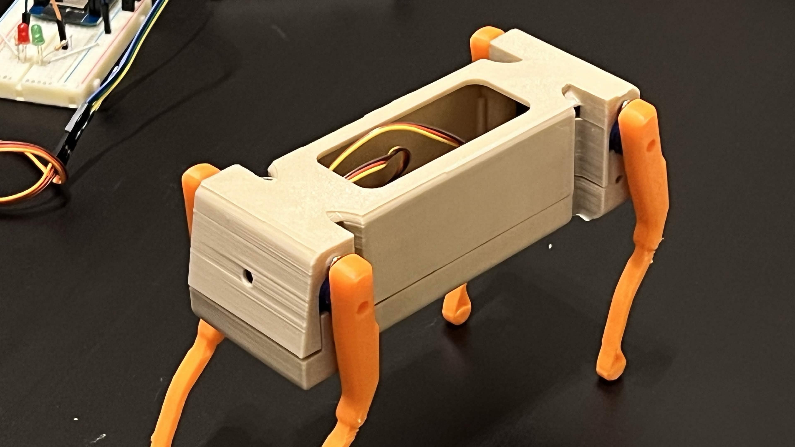
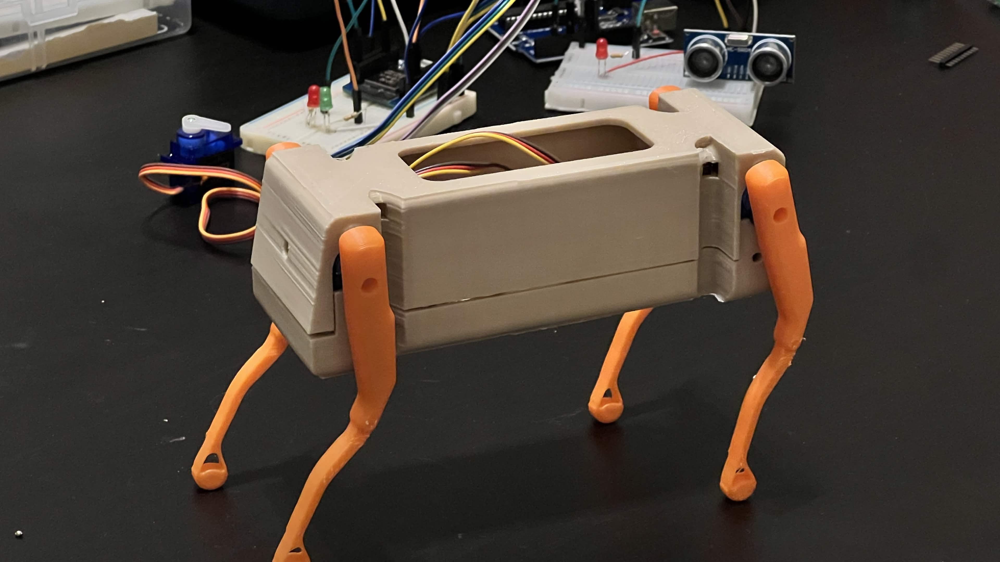
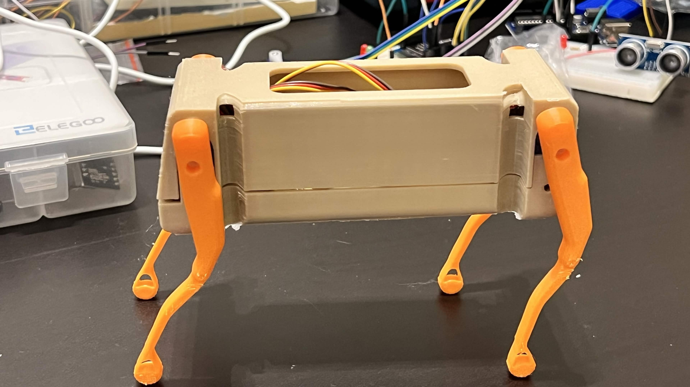

# Mechanical Task 5 – Build The Robot

[Back to Mechanical Track](../README.md)

## Overview

This task focused on physically building the robotic dog that was previously designed and assembled in SOLIDWORKS.

The robot body and legs were assembled to create the final physical structure of the robotic dog and prepare it for movement testing and programming.

## Physical Robot Build

The following images show the completed physical build of the robotic dog from different angles.

### Robot View 1

  

### Robot View 2

  

### Robot View 3

  

## Result

The physical robotic dog was successfully built and assembled.

The completed robot is now ready for servo control, movement programming, and testing.

The next mechanical task focuses on programming the robot to perform three different movements.
