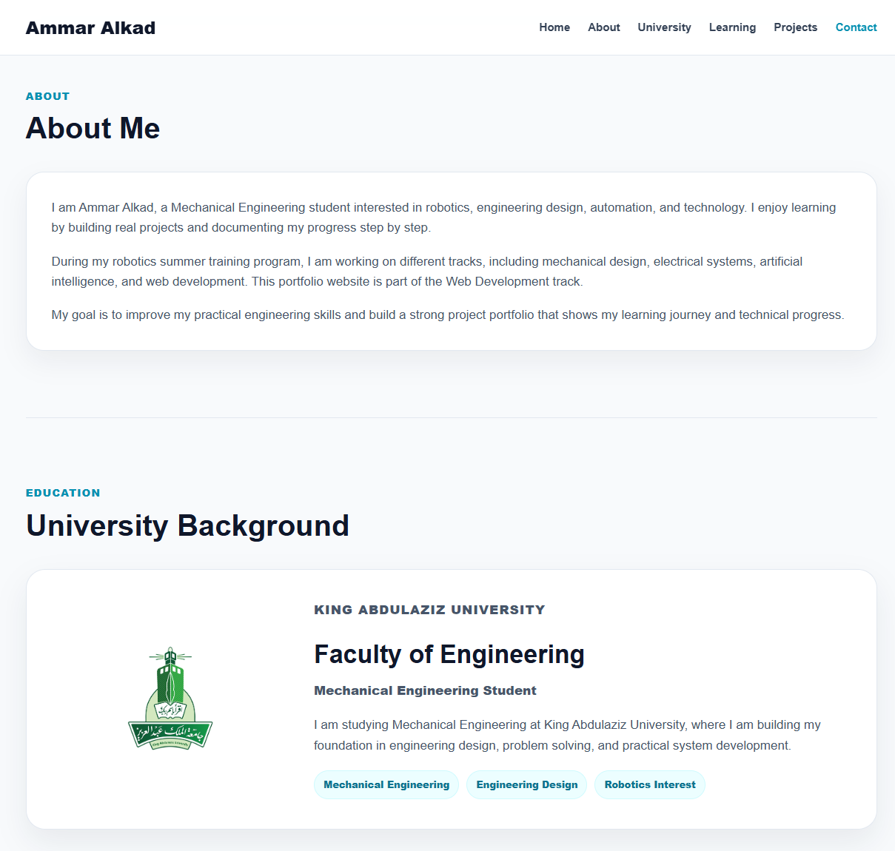
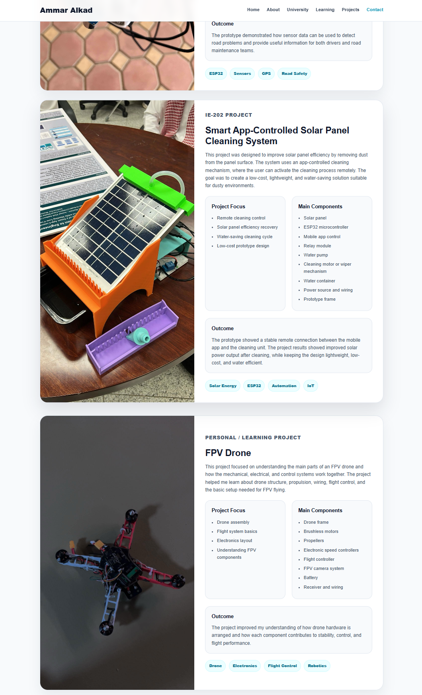
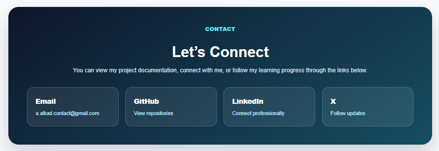

# Task 1 - Personal Portfolio Website

[Back to Web Development Track](../README.md)

## Overview

This task focused on creating and designing a personal portfolio website using HTML, CSS, and JavaScript.

The website was created to present my background, university information, learning progress, engineering projects, and contact links in a clean and organized way.

The website was developed locally using Visual Studio Code, then uploaded and hosted online using InfinityFree.

## Live Website

[View Live Website](https://mllix-portfolio.nfy.fyi/)

## Objective

The objective of this task was to create a personal website that introduces me as a Mechanical Engineering student and showcases some of my engineering and robotics projects.

The website includes information about my university background, learning areas, project details, project images, and contact links.

## Tools and Technologies Used

- HTML
- CSS
- JavaScript
- Visual Studio Code
- InfinityFree Hosting
- GitHub
- Web browser testing

## Website Sections

The website includes the following sections:

1. **Home**
   - Introduction section
   - Short description
   - Navigation buttons

2. **About Me**
   - Personal background
   - Robotics summer training information
   - Learning and project goals

3. **University Background**
   - King Abdulaziz University
   - Faculty of Engineering
   - Mechanical Engineering Student
   - University logo

4. **What I’m Learning**
   - Mechanical Design
   - Electrical Systems
   - Artificial Intelligence
   - Web Development

5. **Projects**
   - Smart Pothole Detection and Alert System
   - Smart App-Controlled Solar Panel Cleaning System
   - FPV Drone

6. **Contact**
   - Email
   - GitHub
   - LinkedIn
   - X

## Project Features

- Clean and responsive portfolio design
- Navigation bar with section links
- University background section with logo
- Project cards with images
- Detailed project descriptions
- Project focus and component lists
- Contact section with social links
- Mobile-friendly layout
- Hosted live using InfinityFree

## Screenshots

### About and University Sections

### Projects Section

### Contact Section

## Projects Included

The website includes the following projects:

- Smart Pothole Detection and Alert System
- Smart App-Controlled Solar Panel Cleaning System
- FPV Drone

## Website Development Process

1. Created a local project folder.
2. Opened the project folder in Visual Studio Code.
3. Created the main website files:
   - `index.html`
   - `style.css`
   - `script.js`
4. Designed the website structure using HTML.
5. Styled the website using CSS.
6. Added simple JavaScript interactions.
7. Added project images and university logo.
8. Tested the website locally in the browser.
9. Created a free hosting account on InfinityFree.
10. Uploaded the website files to the `htdocs` folder.
11. Tested the live website after deployment.
12. Took screenshots and documented the task on GitHub.

