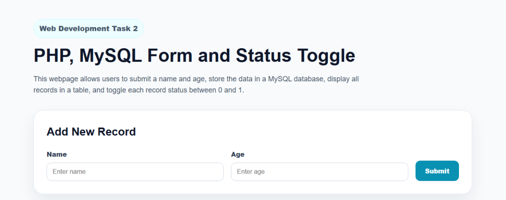
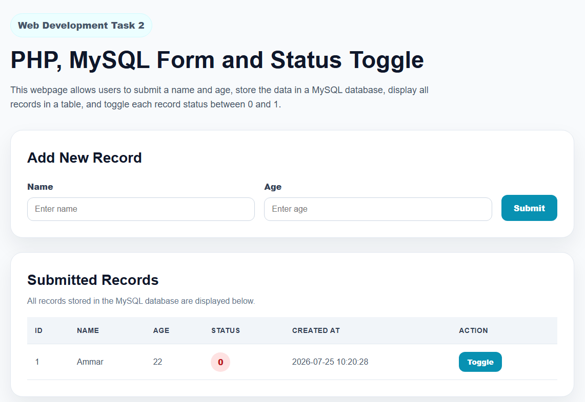
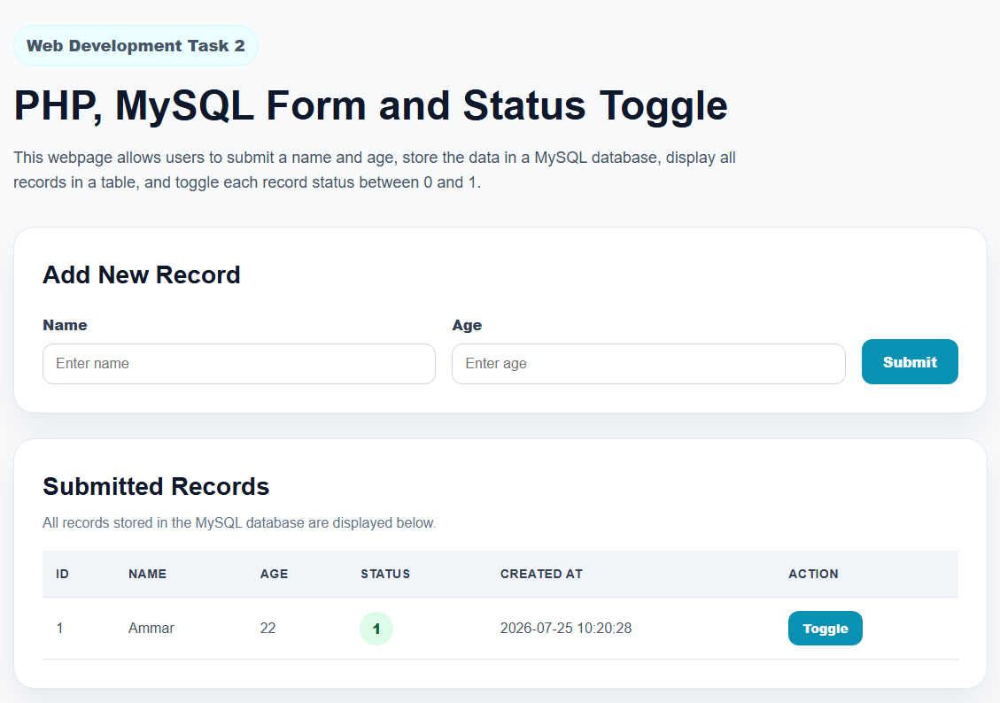
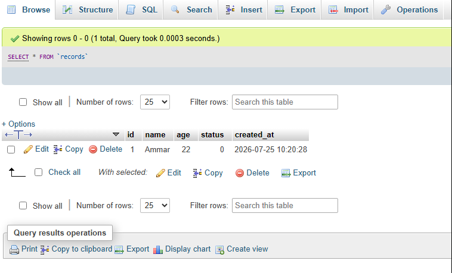
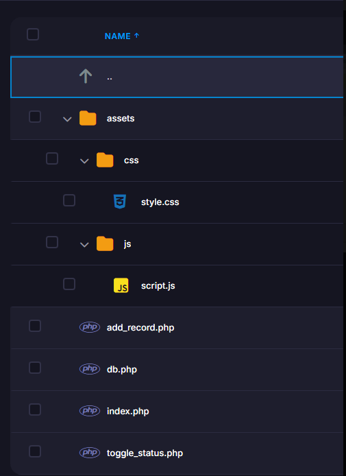

# Task 2 - PHP MySQL Form and Status Toggle

[Back to Web Development Track](../README.md)

## Overview

This task focused on creating a dynamic webpage using HTML, CSS, JavaScript, PHP, and MySQL.

The webpage allows users to submit a name and age using a form. The submitted data is stored in a MySQL database, displayed in a table, and each record includes a toggle button that changes the status value between `0` and `1`.

The task was first developed and tested locally using XAMPP, then uploaded and hosted online using InfinityFree.

## Live Website

[View Live Website](https://mllix-portfolio.nfy.fyi/task-2/)

## Task Requirements

The task required the following:

1. Design a webpage using HTML, CSS, JavaScript, and PHP.
2. Create a one-line form that includes name, age, and a submit button.
3. Store submitted data into a MySQL database table.
4. Display all records from the table in a table below the form.
5. Add a toggle button for each record to switch the status value between `0` and `1`.
6. Reflect the updated status immediately on the webpage after toggling.
7. Upload the files and explain all steps on GitHub.

## Tools and Technologies Used

- HTML
- CSS
- JavaScript
- PHP
- MySQL
- XAMPP
- phpMyAdmin
- Visual Studio Code
- InfinityFree Hosting
- GitHub

## Website Features

- One-line form for name and age input
- Submit button to add records
- MySQL database storage
- Dynamic table displaying all saved records
- Status value for each record
- Toggle button to switch status between `0` and `1`
- Immediate webpage update after toggling
- Clean and responsive interface
- Online deployment using InfinityFree

## Project Process

1. Installed and opened XAMPP.
2. Started Apache and MySQL.
3. Created a local project folder inside `htdocs`.
4. Created a MySQL database using phpMyAdmin.
5. Created a `records` table.
6. Built the main webpage using PHP, HTML, CSS, and JavaScript.
7. Connected the webpage to the MySQL database using PHP PDO.
8. Added form submission functionality.
9. Displayed submitted records in a table.
10. Added a toggle button for each record.
11. Used JavaScript to update the status immediately after toggling.
12. Tested the project locally using `localhost`.
13. Created an online MySQL database on InfinityFree.
14. Uploaded the project files to the `task-2` folder on InfinityFree.
15. Tested the live online version.
16. Documented the task on GitHub.

## Database Table

The project uses a table named `records`.

The table contains:

| Column | Description |
|---|---|
| `id` | Unique ID for each record |
| `name` | Submitted name |
| `age` | Submitted age |
| `status` | Status value, either `0` or `1` |
| `created_at` | Date and time when the record was created |

## SQL Table Code

```sql
CREATE TABLE IF NOT EXISTS records (
  id INT AUTO_INCREMENT PRIMARY KEY,
  name VARCHAR(100) NOT NULL,
  age INT NOT NULL,
  status TINYINT(1) NOT NULL DEFAULT 0,
  created_at TIMESTAMP DEFAULT CURRENT_TIMESTAMP
);
```

## Source Code Note

The real database connection file `db.php` was not uploaded to GitHub because it contains private database login information.

Instead, a safe example file was uploaded:

```text
db.example.php
```

This protects the database password while still showing the required database connection structure.

## GitHub Folder Structure

```text
Task-2-PHP-MySQL-Form/
├── README.md
├── files/
│   ├── database-records.png
│   ├── online-file-structure.png
│   ├── status-after-toggle.png
│   ├── status-before-toggle.png
│   └── webpage-form-records.png
└── source-code/
    ├── add_record.php
    ├── db.example.php
    ├── index.php
    ├── toggle_status.php
    ├── assets/
    │   ├── css/
    │   │   └── style.css
    │   └── js/
    │       └── script.js
    └── sql/
        └── create_table.sql
```

## Screenshots

### Webpage Form and Records Table



### Status Before Toggle



### Status After Toggle



### Database Records in phpMyAdmin



### Online File Structure



## Hosting

The project was hosted using InfinityFree.

The project files were uploaded inside the `task-2` folder, so the task has its own live page without replacing the main portfolio website.

Live website:

[https://mllix-portfolio.nfy.fyi/task-2/](https://mllix-portfolio.nfy.fyi/task-2/)

## Challenges

One challenge was understanding the difference between local development and online hosting.

Locally, the project used XAMPP with Apache, MySQL, and phpMyAdmin. Online, the project needed a separate InfinityFree MySQL database and a different database connection file.

## What I Learned

From this task, I learned:

- How to use XAMPP to run PHP locally
- How to create a MySQL database using phpMyAdmin
- How to create a database table using SQL
- How to connect PHP to MySQL using PDO
- How to insert form data into a database
- How to display database records on a webpage
- How to update a database record using PHP
- How to use JavaScript to update the webpage immediately
- How to upload a PHP project to InfinityFree
- How to document a backend web development task on GitHub

## Reflection

This task helped me understand how frontend and backend web development work together.

I learned that HTML, CSS, and JavaScript control the webpage interface, while PHP and MySQL handle the server-side logic and database storage. The task also helped me practice local development with XAMPP and online deployment using InfinityFree.

This project was an important step because it introduced me to dynamic websites that can store, display, and update data.
