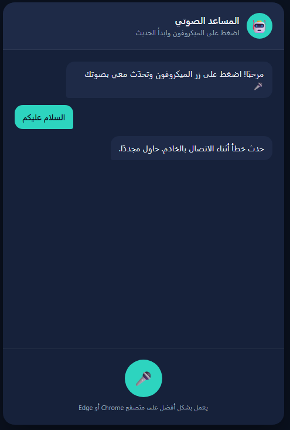
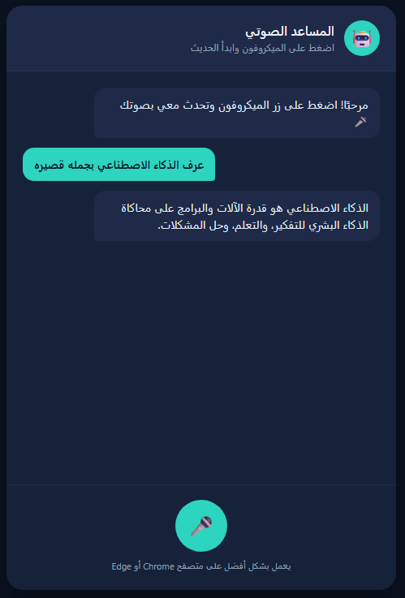

# Task 3 — Voice Assistant PHP Integration and Fix

[Back to Web Development Track](../README.md)

## Overview

This task focused on deploying and repairing a web-based Arabic voice assistant.

The original project included an HTML interface, CSS styling, JavaScript voice-recognition logic, a PHP backend, and Gemini API integration. Although the interface loaded correctly, every submitted voice message displayed a server-connection error.

The project was tested locally using XAMPP, repaired, deployed to InfinityFree, and documented on GitHub.

## Task Requirements

The task required:

1. Uploading all HTML, CSS, JavaScript, and PHP files to a server
2. Fixing the PHP connection problem
3. Testing the completed voice assistant
4. Uploading the safe project files to GitHub
5. Explaining all development and deployment steps

## Final Result

The completed website can:

- Record Arabic speech through the browser
- Convert the user's speech into text
- Send the recognized text to a PHP backend
- Send the prompt securely to the Gemini API
- Receive an AI-generated response
- Remove unnecessary Markdown formatting
- Display the response in Arabic
- Read the AI response aloud using browser speech synthesis

## Live Website

[Open the deployed Voice Assistant](https://mllix-portfolio.nfy.fyi/Task-3-Voice-Assistant/)

## Application Workflow

```text
User Voice
    ↓
Browser Speech Recognition
    ↓
Recognized Arabic Text
    ↓
voice-assistant.js
    ↓
assistant.php
    ↓
Gemini API
    ↓
Generated AI Response
    ↓
Cleaned Response Text
    ↓
Browser Speech Synthesis
    ↓
Spoken Arabic Response
```

## Technologies Used

- HTML5
- CSS3
- JavaScript
- PHP
- Gemini API
- Web Speech API
- Browser Speech Recognition
- Browser Speech Synthesis
- JSON
- Fetch API
- Apache
- XAMPP
- InfinityFree
- Visual Studio Code
- Chrome Developer Tools
- GitHub

## Repository Structure

```text
Task-3-Voice-Assistant
│
├── README.md
│
├── source-code
│   ├── .htaccess
│   ├── assistant.php
│   ├── config.example.php
│   ├── index.html
│   ├── style.css
│   └── voice-assistant.js
│
└── screenshots
    ├── original-connection-error.png
    └── working-online-assistant.png
```

## Source-Code Responsibilities

### `index.html`

Defines the structure of the Arabic voice-assistant interface.

It contains:

- Application header
- Assistant avatar
- Microphone button
- Status text
- Conversation area
- Arabic right-to-left layout
- Links to the stylesheet and JavaScript file

The page uses:

```html
<html lang="ar" dir="rtl">
```

and:

```html
<meta charset="UTF-8">
```

to support Arabic text correctly.

### `style.css`

Controls the visual appearance of the application.

It defines:

- Page background
- Chat container
- Header design
- User-message styling
- Assistant-message styling
- Microphone button
- Listening animation
- Responsive layout
- Arabic text alignment

### `voice-assistant.js`

Controls the browser-side application logic.

Its responsibilities include:

- Accessing the microphone
- Using the browser Speech Recognition API
- Converting Arabic speech into text
- Displaying the user's message
- Sending the prompt to `assistant.php`
- Reading and validating the JSON response
- Removing Markdown formatting
- Displaying the assistant response
- Converting the response into spoken audio
- Handling microphone and server errors

The backend URL is:

```javascript
const BACKEND_URL = "./assistant.php";
```

### `assistant.php`

Acts as the secure server-side backend.

Its responsibilities include:

- Accepting only POST requests
- Reading JSON sent by JavaScript
- Validating the submitted prompt
- Loading the private API configuration
- Sending the prompt to Gemini
- Handling cURL and API errors
- Extracting the generated response
- Returning valid JSON to the frontend

Successful responses use a structure similar to:

```json
{
  "reply": "Generated assistant response",
  "model": "Configured Gemini model"
}
```

### `config.example.php`

Provides a safe API configuration template.

It contains placeholders rather than a real API key:

```php
<?php

declare(strict_types=1);

define(
    'GEMINI_API_KEY',
    'PASTE_YOUR_REAL_GEMINI_API_KEY_HERE'
);

define(
    'GEMINI_MODEL',
    'gemini-3.5-flash'
);
```

To run the application, this file must be copied and renamed to:

```text
config.php
```

The placeholder must then be replaced with a valid Gemini API key.

The real `config.php` is private and is not included in the GitHub repository.

### `.htaccess`

Protects private server configuration and prevents directory listing.

```apache
Options -Indexes

<Files "config.php">
    Require all denied
</Files>
```

This allows the PHP backend to load `config.php` internally while preventing visitors from opening it directly through the browser.

## Original Problem

The original website interface loaded successfully, but every voice message resulted in:

```text
حدث خطأ أثناء الاتصال بالخادم. حاول مجددًا.
```

English meaning:

```text
An error occurred while connecting to the server.
Please try again.
```



The error was caused by multiple frontend, backend, configuration, hosting, and caching problems.

## Problems Discovered

### Problem 1 — Incorrect JavaScript Backend Path

The original JavaScript requested:

```javascript
const BACKEND_URL = "api/chat.php";
```

This produced a request to:

```text
/Task-3-Voice-Assistant/api/chat.php
```

However, the PHP file was located directly inside the project folder:

```text
/Task-3-Voice-Assistant/chat.php
```

Because the `api` folder did not exist, Apache returned:

```text
404 Not Found
```

### Solution

The JavaScript path was initially corrected to:

```javascript
const BACKEND_URL = "./chat.php";
```

Later, the backend file was renamed to `assistant.php`, so the final path became:

```javascript
const BACKEND_URL = "./assistant.php";
```

---

### Problem 2 — Incorrect PHP Configuration Path

The original PHP file used:

```php
require __DIR__ . '/../config.php';
```

This expected `config.php` to exist one directory above the project.

However, `config.php` was located in the same directory as the PHP backend.

### Solution

The configuration path was changed to:

```php
require __DIR__ . '/config.php';
```

---

### Problem 3 — Incorrect API-Key Constant

The original configuration contained:

```php
define('YOUR_API_KEY_HERE', '');
```

This created a constant named `YOUR_API_KEY_HERE` with an empty value.

The PHP backend expected:

```php
GEMINI_API_KEY
```

### Solution

The configuration was corrected to:

```php
define(
    'GEMINI_API_KEY',
    'YOUR_REAL_API_KEY'
);
```

The real key remains only inside the private server-side `config.php`.

---

### Problem 4 — InfinityFree Blocked `chat.php`

The project worked locally after correcting the path and configuration.

However, the online InfinityFree version still returned:

```text
403 Forbidden
```

Developer Tools showed that requests to:

```text
chat.php
```

were redirected to InfinityFree's 403 error page.

### Solution

The backend file was renamed from:

```text
chat.php
```

to:

```text
assistant.php
```

The JavaScript was updated to use:

```javascript
const BACKEND_URL = "./assistant.php";
```

After the rename, the PHP endpoint became accessible on the hosting server.

---

### Problem 5 — Browser Loaded an Old JavaScript File

Even after uploading the corrected JavaScript, the live website continued requesting the old `chat.php` endpoint.

The live page source still contained:

```html
<script src="app.js"></script>
```

### Solution

The JavaScript file was renamed from:

```text
app.js
```

to:

```text
voice-assistant.js
```

The HTML was updated to:

```html
<script src="voice-assistant.js?v=1"></script>
```

Renaming the file and adding a version query forced the browser to download the current JavaScript instead of using an older cached copy.

---

### Problem 6 — Visible Markdown Symbols

Gemini sometimes returned formatting such as:

```text
**الذكاء الاصطناعي**
```

Because responses were displayed as plain text, symbols such as `**`, `#`, and backticks appeared in the conversation.

### Solution

A response-cleaning function was added to JavaScript.

It removes:

- Bold markers
- Italic markers
- Heading symbols
- Inline-code markers
- Code-block markers
- Quote markers
- List markers
- Excessive blank lines

The cleaned response is used for both display and speech synthesis.

## Development Process

The project was completed through the following stages:

1. Download the original project files
2. Create a local XAMPP project folder
3. Place the files inside Apache's `htdocs`
4. Start the Apache server
5. Open the project through `localhost`
6. Reproduce the original connection error
7. Inspect the browser Console and Network panels
8. Identify the failed PHP request
9. Correct the JavaScript backend path
10. Correct the PHP configuration path
11. Configure the Gemini API key
12. Improve PHP request validation
13. Improve JSON response handling
14. Test the Gemini API locally
15. Add Markdown-response cleaning
16. Protect `config.php` using `.htaccess`
17. Test the complete local application
18. Create a separate InfinityFree project folder
19. Upload all required files
20. Test the online PHP endpoint
21. Identify the InfinityFree `chat.php` block
22. Rename the backend to `assistant.php`
23. Replace the cached JavaScript file
24. Test the deployed website
25. Verify that `config.php` returns 403 Forbidden
26. Prepare the safe GitHub source files
27. Create the final documentation

## Local Development Setup

The local project was placed inside:

```text
C:\xampp\htdocs\Task-3-Voice-Assistant
```

The local structure was:

```text
Task-3-Voice-Assistant
├── .htaccess
├── assistant.php
├── config.php
├── index.html
├── style.css
└── voice-assistant.js
```

The local website was opened through:

```text
http://localhost/Task-3-Voice-Assistant/
```

The HTML file was not opened directly from File Explorer because PHP must run through Apache.

## Local Installation

### 1. Install XAMPP

Install XAMPP with Apache and PHP.

### 2. Copy the project

Place the source files inside:

```text
C:\xampp\htdocs\Task-3-Voice-Assistant
```

### 3. Create the private configuration

Copy:

```text
config.example.php
```

and rename the copy to:

```text
config.php
```

Add the real Gemini API key inside `config.php`.

### 4. Start Apache

Open the XAMPP Control Panel and click **Start** next to Apache.

### 5. Open the project

Visit:

```text
http://localhost/Task-3-Voice-Assistant/
```

### 6. Allow microphone access

Chrome or Edge will request permission to use the microphone.

## InfinityFree Deployment

The project was uploaded to an existing InfinityFree hosting account.

A separate folder was created inside:

```text
htdocs
```

The online structure became:

```text
htdocs
└── Task-3-Voice-Assistant
    ├── .htaccess
    ├── assistant.php
    ├── config.php
    ├── index.html
    ├── style.css
    └── voice-assistant.js
```

The deployed website is available at:

```text
https://mllix-portfolio.nfy.fyi/Task-3-Voice-Assistant/
```

## Deployment Steps

1. Sign in to InfinityFree
2. Open the existing hosting account
3. Open the File Manager
4. Enter the `htdocs` directory
5. Create `Task-3-Voice-Assistant`
6. Upload the HTML, CSS, JavaScript, and PHP files
7. Create `.htaccess`
8. Add the private `config.php`
9. Test the PHP endpoint
10. Test the complete online website
11. Verify browser microphone permission
12. Verify that `assistant.php` returns a successful response
13. Verify that `config.php` is blocked

## API-Key Security

The Gemini API key is never stored in:

- HTML
- CSS
- JavaScript
- GitHub source code
- Screenshots
- Public documentation

The key is stored only in:

```text
config.php
```

The public repository contains:

```text
config.example.php
```

Direct browser access to `config.php` is blocked using `.htaccess`.

When tested online, opening `config.php` returned:

```text
403 Forbidden
```

## Error Handling

The final project includes handling for:

- Unsupported speech-recognition browsers
- Microphone access failures
- Empty recognized speech
- PHP request failures
- HTTP error responses
- Invalid server JSON
- Empty Gemini responses
- Missing API configuration
- Invalid request methods
- Invalid JSON request bodies
- cURL connection failures
- Gemini API errors
- Text-to-Speech availability
- Repeated speech playback

## Testing

### Local Testing

The application was tested through XAMPP using:

```text
http://localhost/Task-3-Voice-Assistant/
```

The following were confirmed:

- The interface loaded correctly
- Arabic speech was recognized
- JavaScript sent the request to PHP
- PHP contacted Gemini successfully
- JSON was returned correctly
- The response appeared in the conversation
- Markdown symbols were removed
- The response was spoken aloud
- `config.php` was protected

### Online Testing

The deployed InfinityFree version was tested using:

```text
https://mllix-portfolio.nfy.fyi/Task-3-Voice-Assistant/
```

The following were confirmed:

- The website loaded through HTTPS
- Microphone permission worked
- Arabic voice recognition worked
- `assistant.php` received POST requests
- Gemini generated valid responses
- The response appeared without Markdown symbols
- Browser speech synthesis played the response
- The website worked in a private browser window
- `config.php` returned 403 Forbidden

## Screenshots

### Original Connection Error

The original project displayed a connection error whenever the user submitted a voice message.


### Working Online Assistant

After fixing the frontend path, PHP configuration, InfinityFree restriction, caching issue, and response formatting, the deployed assistant successfully processed Arabic voice input and returned a Gemini response.



## Challenges and Solutions

### Finding the actual source of the error

The visible message only stated that a server connection error occurred.

Chrome Developer Tools was used to identify the real failed request and HTTP status.

### Differences between local and online hosting

The corrected project worked through XAMPP but failed on InfinityFree because the hosting service blocked the `chat.php` path.

Renaming the backend to `assistant.php` solved the hosting-specific issue.

### Browser caching

The browser continued loading an older JavaScript file even after the updated file had been uploaded.

Renaming the JavaScript file and adding a version query ensured that the latest file was loaded.

### Protecting the API key

The project required a Gemini API key, but placing it inside JavaScript would expose it publicly.

The API request was kept inside PHP, and the real configuration file was excluded from GitHub and protected through Apache.

### Supporting Arabic content

The project required correct handling of Arabic speech, text direction, JSON output, and spoken responses.

UTF-8 encoding and right-to-left HTML configuration were used throughout the project.

## What I Learned

Through this task, I learned how to:

- Run PHP websites locally using XAMPP
- Use Apache's `htdocs` directory
- Inspect failed requests using browser Developer Tools
- Understand HTTP status codes such as 404, 403, and 200
- Connect JavaScript to a PHP backend using Fetch
- Send and receive JSON
- Use PHP cURL to call an external API
- Integrate Gemini into a web application
- Protect API keys on the server
- Configure `.htaccess`
- Debug differences between local and hosted environments
- Work with InfinityFree File Manager
- Resolve browser-cache problems
- Use browser speech recognition
- Use browser speech synthesis
- Process Arabic text using UTF-8
- Improve error handling
- Document a complete debugging and deployment process

## Result

The repaired project successfully completes the required workflow:

```text
Arabic Voice Input
        ↓
Speech Recognition
        ↓
PHP Backend
        ↓
Gemini API
        ↓
Generated Arabic Response
        ↓
Text Display
        ↓
Spoken Response
```

The application now works both locally through XAMPP and online through InfinityFree.

## Future Improvements

Possible future improvements include:

- Add typed-message input
- Add conversation history
- Improve mobile responsiveness
- Add loading animation
- Add automatic silence detection
- Add microphone permission instructions
- Add selectable languages
- Add selectable voices
- Add response-length controls
- Add conversation reset button
- Add stronger server-side rate limiting
- Store API keys using server environment variables
- Add logging without exposing sensitive information
- Add a dedicated domain or subdomain

## Navigation

- [Open the source code](source-code/)
- [Open the screenshots](screenshots/)
- [Open the live website](https://mllix-portfolio.nfy.fyi/Task-3-Voice-Assistant/)
- [Back to Web Development Track](../README.md)
